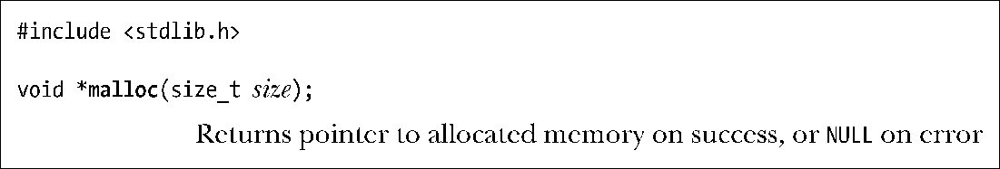
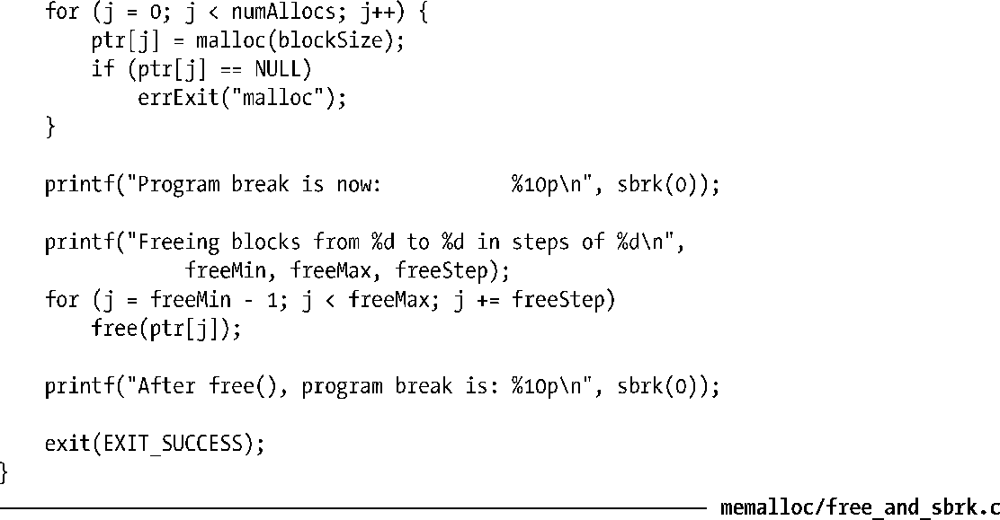
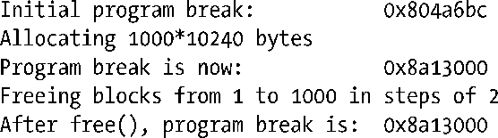
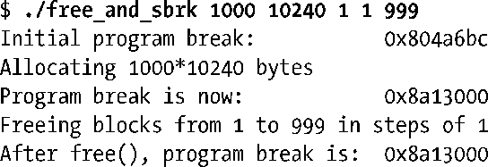
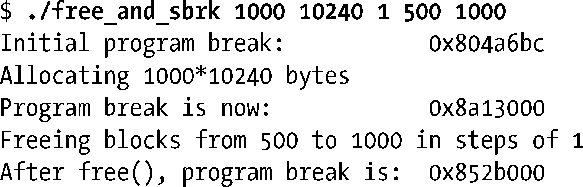

### 7.1.2　在堆上分配内存：malloc()和free()

一般情况下，C程序使用malloc函数族在堆上分配和释放内存。较之brk()和sbrk()，这些函数具备不少优点，如下所示。

+ 属于C语言标准的一部分。
+ 更易于在多线程程序中使用。
+ 接口简单，允许分配小块内存。
+ 允许随意释放内存块，它们被维护于一张空闲内存列表中，在后续内存分配调用时循环使用。

malloc( )函数在堆上分配参数size字节大小的内存，并返回指向新分配内存起始位置处的指针，其所分配的内存未经初始化。

由于malloc()的返回类型为void*，因而可以将其赋给任意类型的C指针。malloc()返回内存块所采用的字节对齐方式，总是适宜于高效访问任何类型的C语言数据结构。在大多数硬件架构上，这实际意味着malloc是基于8字节或16字节边界来分配内存的。①

> SUSv3规定：调用malloc(0)要么返回NULL，要么是一小块可以（并且应该）用free()释放的内存。Linux的malloc(0)行为遵循后者。

若无法分配内存（或许是因为已经抵达program break所能达到的地址上限），则malloc()返回NULL，并设置errno以返回错误信息。虽然分配内存失败的可能性很小，但所有对malloc()以及后续提及的相关函数的调用都应对返回值进行错误检查。

free()函数释放ptr参数所指向的内存块，该参数应该是之前由malloc()，或者本章后续描述的其他堆内存分配函数之一所返回的地址。

一般情况下，free()并不降低program break的位置，而是将这块内存填加到空闲内存列表中，供后续的malloc()函数循环使用。这么做是出于以下几个原因。

+ 被释放的内存块通常会位于堆的中间，而非堆的顶部，因而降低porgram break是不可能的。
+ 它最大限度地减少了程序必须执行的sbrk()调用次数。（正如3.1节指出的，系统调用的开销虽小，却也颇为可观。）
+ 在大多数情况下，降低program break的位置不会对那些分配大量内存的程序有多少帮助，因为它们通常倾向于持有已分配内存或是反复释放和重新分配内存，而非释放所有内存后再持续运行一段时间。

如果传给free()的是一个空指针，那么函数将什么都不做。（换句话说，给free()传入一个空指针并不是错误代码。）

在调用free()后对参数ptr的任何使用，例如将其再次传递给free()，将产生错误，并可能导致不可预知的结果。

#### 程序示例

程序清单7-1中的程序说明了free()函数对program break的影响。该程序在分配了多块内存后，根据（可选）命令行参数来释放其中的部分或全部。

前两个命令行参数指定了分配内存块的数量和大小。第三个命令行参数指定了释放内存块的循环步长。如果是 1（这也是省略此参数时的默认值），那么程序将释放每块已分配的内存，如果为 2，那么每隔一块释放一块已分配内存，以此类推。第四个和第五个命令行参数指定需要释放的内存块范围。如果省略这两个参数，那么将（以第三个命令行参数所指定的步长）释放全部范围内的已分配内存。

程序清单7-1：示范释放内存时program break的行为

用下面的命令行运行程序清单7-1的程序，将会分配1000个内存块，且每隔一个内存块释放一个内存块。

输出结果显示，释放所有内存块后，program break 的位置仍然与分配所有内存块后的水平相当。

下面的命令行要求除了最后一块内存块，释放所有已分配的内存块。再一次，program break保持在了“高水位线”。

但是，如果在堆顶部释放完整的一组连续内存块，会观察到program break从峰值上降下来，这表明free()使用了sbrk()来降低program break。在这里，命令行释放了已分配内存的最后500个内存块。

在这种情况下，free()函数的glibc实现会在释放内存时将相邻的空闲内存块合并为一整块更大的内存（这样做是为了避免在空闲内存列表中包含大量的小块内存碎片，这些碎片会因空间太小而难以满足后续的malloc()请求），因而也有能力识别出堆顶部的整个空闲区域。

> 仅当堆顶空闲内存“足够”大的时候，free()函数的glibc实现会调用sbrk()来降低program break的地址，至于“足够”与否则取决于malloc函数包行为的控制参数（128 KB为典型值）。这减少了必须对sbrk()发起的调用次数（亦即对brk()系统调用的调用次数）。

#### 调用free()还是不调用free()

当进程终止时，其占用的所有内存都会返还给操作系统，这包括在堆内存中由malloc函数包内一系列函数所分配的内存。基于内存的这一自动释放机制，对于那些分配了内存并在进程终止前持续使用的程序而言，通常会省略对free()的调用。这在程序中分配了多块内存的情况下可能会特别有用，因为加入多次对free()的调用不但会消耗大量的CPU时间，而且可能会使代码趋于复杂。

虽然依靠终止进程来自动释放内存对大多数程序来说是可以接受的，但基于以下几个原因，最好能够在程序中显式释放所有的已分配内存。

+ 显式调用free()能使程序在未来修改时更具可读性和可维护性。
+ 如果使用malloc调试库（如下所述）来查找程序的内存泄漏问题，那么会将任何未经显式释放处理的内存报告为内存泄漏。这会使发现真正内存泄漏的工作复杂化。

