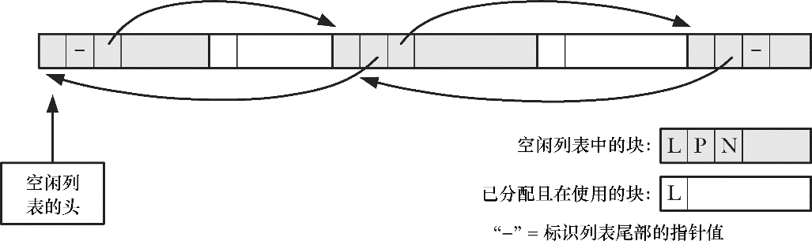

### 7.1.3　malloc()和free()的实现

尽管malloc()和free()所提供的内存分配接口比之brk()和sbrk()要容易许多，但在使用时仍然容易犯下各种编程错误。理解malloc()和free()的实现，将使我们洞悉产生这些错误的原因以及如何才能避免此类错误。

malloc()的实现很简单。它首先会扫描之前由free()所释放的空闲内存块列表，以求找到尺寸大于或等于要求的一块空闲内存。（取决于具体实现，采用的扫描策略会有所不同。例如，first-fit或best-fito。）如果这一内存块的尺寸正好与要求相当，就把它直接返回给调用者。如果是一块较大的内存，那么将对其进行分割，在将一块大小相当的内存返回给调用者的同时，把较小的那块空闲内存块保留在空闲列表中。

如果在空闲内存列表中根本找不到足够大的空闲内存块，那么malloc()会调用sbrk()以分配更多的内存。为减少对sbrk()的调用次数，malloc()并未只是严格按所需字节数来分配内存，而是以更大幅度（以虚拟内存页大小的数倍）来增加program break，并将超出部分置于空闲内存列表。

至于free()函数的实现则更为有趣。当free()将内存块置于空闲列表之上时，是如何知晓内存块大小的？这是通过一个小技巧来实现的。当malloc()分配内存块时，会额外分配几个字节来存放记录这块内存大小的整数值。该整数位于内存块的起始处，而实际返回给调用者的内存地址恰好位于这一长度记录字节之后，如图7-1所示。

<b class="my_markdown">图7-1：malloc()返回的内存块</b>

当将内存块置于空闲内存列表（双向链表）时，free()会使用内存块本身的空间来存放链表指针，将自身添加到列表中，如图7-2所示。

<b class="my_markdown">图7-2：空闲列表中的内存块</b>

随着对内存不断地释放和重新分配，空闲列表中的空闲内存会和已分配的在用内存混杂在一起，如图7-3所示。

<b class="my_markdown">图7-3：包含有已分配内存和空闲内存列表的堆</b>

应该认识到，C 语言允许程序创建指向堆中任意位置的指针，并修改其指向的数据，包括由free()和malloc()函数维护的内存块长度、指向前一空闲块和后一空闲块的指针。辅之以之前的描述，一旦推究起隐晦难解的编程缺陷来，这无疑形同掉进了火药桶。例如，假设经由一个错误指针，程序无意间增加了冠于一块已分配内存的长度值，并随即释放这块内存，free()因之会在空闲列表中记录下这块长度失真的内存。随后，malloc()也许会重新分配这块内存，从而导致如下场景：程序的两个指针分别指向两块它认为互不相干的已分配内存，但实际上这两块内存却相互重叠。至于其他的出错情况则数不胜数。

要避免这类错误，应该遵守以下规则。

+ 分配一块内存后，应当小心谨慎，不要改变这块内存范围外的任何内容。错误的指针运算，或者循环更新内存块内容时出现的“off-by-one”（一字之偏）②错误，都有可能导致这一情况。
+ 释放同一块已分配内存超过一次是错误的。Linux 上的 glibc 库经常报出分段错误（SIGSEGV 信号）。这是好事，因为它提醒我们犯下了一个编程错误。然而，当两次释放同一块内存时，更常见的后果是导致不可预知的行为。
+ 若非经由malloc函数包中函数所返回的指针，绝不能在调用free()函数时使用。
+ 在编写需要长时间运行的程序（例如，shell或网络守护进程）时，出于各种目的，如果需要反复分配内存，那么应当确保释放所有已使用完毕的内存。如若不然，堆将稳步增长，直至抵达可用虚拟内存的上限，在此之后分配内存的任何尝试都将以失败告终。这种情况被称之为“内存泄漏”。

#### malloc调试的工具和库

如果不遵循上述准则，可能会在代码中引入既难以理解又难以重现的缺陷。而使用 glibc提供的malloc调试工具或者任何一款malloc调试库，都会显著降低发现这些缺陷的难度，这也是设计它们的目的所在。

以下是glibc提供的malloc调试工具的部分功能。

+ mtrace()和muntrace()函数分别在程序中打开和关闭对内存分配调用进行跟踪的功能。这些函数要与环境变量MALLOC_TRACE搭配使用，该变量定义了写入跟踪信息的文件名。在被调用时，mtrace()会检查是否定义了该文件，又是否可以打开文件并写入。如果一切正常，那么会在文件里跟踪和记录所有对malloc函数包中函数的调用。由于生成文件不易于理解，还提供有一个脚本（mtrace）用于分析文件，并生成易于理解的汇总报告。出于安全原因，设置用户ID和设置组ID的程序会忽略对mtrace()的调用。
+ mcheck()和mprobe()函数允许程序对已分配内存块进行一致性检查。例如，当程序试图在已分配内存之外进行写操作时，它们将捕获这个错误。这些函数提供的功能和下述malloc调试库有重叠之处。使用这些函数的程序，必须使用cc-lmcheck选项与mcheck库链接。
+ MALLOC_CHECK_环境变量（注意结尾处的下划线）提供了类似于mcheck()和mprobe()函数的功能。（两者之间的一个显著区别在于使用：MALLOC_CHECK_无需对程序进行修改和重新编译。）通过为此变量设置不同的整数值，可以控制程序对内存分配错误的响应方式。可能的设置有：0，意即忽略错误；1，意即在标准错误输出（stderr）中打印诊断错误；2，意即调用abort()来终止程序。并非所有的内存分配和释放错误都是由MALLOC_CHECK_检测出的，它所发现的只是常见错误。但是，这种技术快速、易用，较之于malloc调试库具有较低的运行时开销。出于安全原因，设置用户ID和设置组ID的程序将忽略MALLOC_CHECK_设置。

关于以上所有功能更为详细的信息可以参考glibc手册。

而就malloc调试库而言，其提供了和标准malloc函数包相同的API，但附加了捕获内存分配错误的功能。要使用调试库，需要在编译时链接调试库，而非标准C函数库的malloc函数包。由于调试库通常会降低运行速度，增加内存消耗，或是两者兼而有之，应当仅在调试时使用，而在正式发布产品时链接标准库的malloc包。这些库分别是：Electric Fence（http://www.perens.com/ FreeSoftware/）、dmalloc（http://dmalloc.com/）、Valgrind（http://valgrind.org/）、Insure++（http://www.parasoft.com/）。

> Valgrind和Insure++能够发现许多堆内存分配之外的其他类型错误。可以访问其各自网站，以获取详细信息。

#### 控制和监测malloc函数包

glibc手册介绍了一系列非标准函数，可用于监测和控制malloc包中函数的内存分配，其中包括如下几个函数。

+ 函数mallopt()能修改各项参数，以控制malloc()所采用的算法。例如，此类参数之一就指定了在调用sbrk()函数进行堆收缩之前，在空闲列表尾部必须保有的可释放内存空间的最小值。另一参数则规定了从堆中分配的内存块大小的上限，超出上限的内存块则使用mmap()系统调用（参见49.7节）来分配。
+ mallinfo()函数返回一个结构，其中包含由malloc()分配内存的各种统计数据。

众多UNIX实现提供各种版本的mallopt()和mallinfo()。然而，这些函数所提供的接口却随实现而不同，因而也无法移植。

