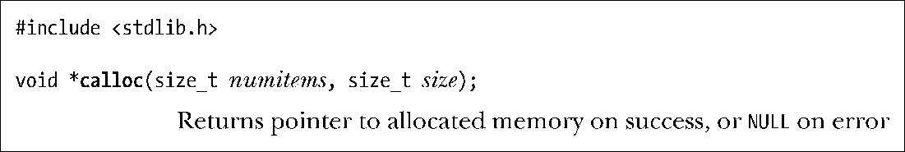
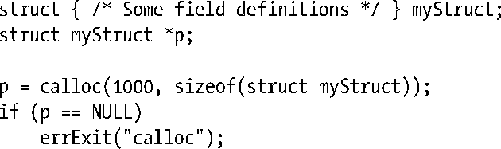
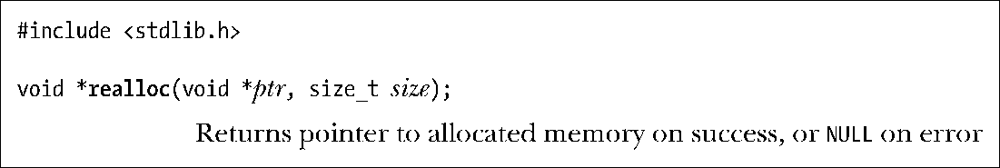
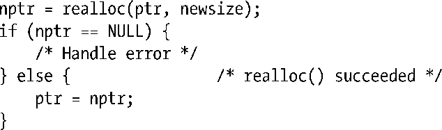
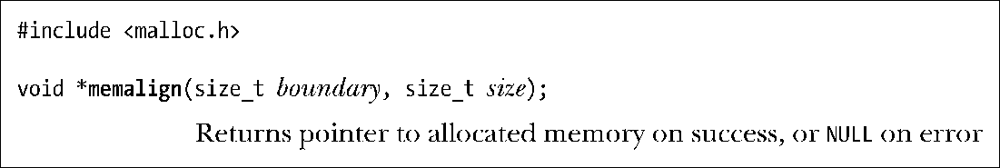
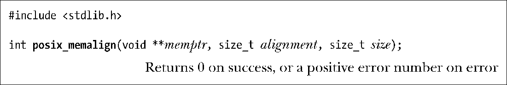
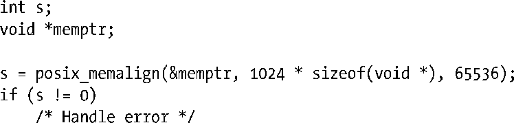

### 7.1.4　在堆上分配内存的其他方法

除了malloc()，C函数库还提供了一系列在堆上分配内存的其他函数，在这里将逐一介绍。

#### 用calloc()和realloc()分配内存

函数calloc()用于给一组相同对象分配内存。

参数mumitems指定分配对象的数量，size指定每个对象的大小。在分配了适当大小的内存块后，calloc()返回指向这块内存起始处的指针（如果无法分配内存，则返回NULL）。与malloc()不同，calloc()会将已分配的内存初始化为0。

下面是calloc()的一个使用范例：

realloc()函数用来调整（通常是增加）一块内存的大小，而此块内存应是之前由malloc包中函数所分配的。

参数ptr是指向需要调整大小的内存块的指针。参数size指定所需调整大小的期望值。

如果成功，realloc()返回指向大小调整后内存块的指针。与调用前的指针相比，二者指向的位置可能不同。如果发生错误，realloc()返回NULL，对ptr指针指向的内存块则原封不动（SUSv3要求满足这一约定）。

若realloc()增加了已分配内存块的大小，则不会对额外分配的字节进行初始化。

使用calloc()或realloc()分配的内存应使用free()来释放。

> 调用realloc(ptr,0)等效于在free(ptr)之后调用malloc(0)。若ptr为NULL，则realloc(NULL, size)相当于调用malloc(size)。

通常情况下，当增大已分配内存时，realloc()会试图去合并在空闲列表中紧随其后③且大小满足要求的内存块。若原内存块位于堆的顶部，那么realloc()将对堆空间进行扩展。如果这块内存位于堆的中部，且紧邻其后的空闲内存空间大小不足，realloc()会分配一块新内存，并将原有数据复制到新内存块中。最后这种情况最为常见，还会占用大量CPU资源。一般情况下，应尽量避免调用realloc()。

既然realloc()可能会移动内存，对这块内存的后续引用就必须使用realloc()的返回指针。可以用realloc()来重新定位由变量ptr指向的内存块，代码如下：

本例并没有把realloc()的返回值直接赋给ptr，因为一旦调用realloc()失败，那么ptr会被置为NULL，从而无法访问现有内存块。

由于realloc()可能会移动内存块，任何指向该内存块内部的指针在调用realloc()之后都可能不再可用。仅有一种内存块内的位置引用方法依然有效，即以指向此块内存起始处的指针再加上一个偏移量来进行定位，这将在48.6节中详细讨论。

#### 分配对齐的内存：memalign()和posix_memalign()

设计函数memalign()和posix_memalign()的目的在于分配内存时，起始地址要与2的整数次幂边界对齐，该特征对于某些应用非常有用（例如程序清单13-1）。

函数 memalign()分配 size 个字节的内存，起始地址是参数 boundary 的整数倍，而boundary必须是2的整数次幂。函数返回已分配内存的地址。

函数memalign()并非在所有UNIX实现上都存在。大多数提供memalign()的其他UNIX实现都要求引用<stdlib.h>而非<malloc.h>以获得函数声明。

SUSv3并未纳入memalign()，而是规范了一个类似函数，名为posix_memalign()。该函数由标准委员会于近期创制，只是出现在了少数UNIX实现上。

函数posix_memalign()与memalign()存在以下两方面的不同。

+ 已分配的内存地址通过参数memptr返回。
+ 内存与alignment参数的整数倍对齐④，alignment必须是sizeof（void*）（在大多数硬件架构上是4或8个字节）与2的整数次幂两者间的乘积。

还要注意该函数与众不同的返回值，出错时不是返回−1，而是直接返回一个错误号（即通常在errno中返回的正整数）。

如果SizeOf(void *)为4，就可以使用posix_memalign()分配65536字节的内存，并与4096字节的边界对齐，代码如下：

由memalign()或posix_memalign()分配的内存块应该调用free()来释放。

> 在一些UNIX实现中，无法通过调用free()来释放由memalign()分配的内存，因为此类memalign()在实现时使用malloc()来分配内存块，然后返回一个指针，指向该块内已对齐的适当地址。glibc的memalign()则不受此限制。

