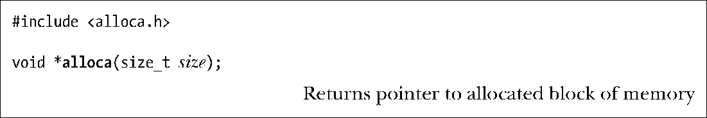
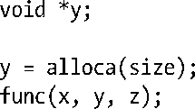

### 7.2　在堆栈上分配内存：alloca()

和malloc函数包中的函数功能一样，alloca()也可以动态分配内存，不过不是从堆上分配内存，而是通过增加栈帧的大小从堆栈上分配。根据定义，当前调用函数的栈帧位于堆栈的顶部，故而这种方法是可行的。因此，帧的上方存在扩展空间，只需修改堆栈指针值即可。

参数size指定在堆栈上分配的字节数。函数alloca()将指向已分配内存块的指针作为其返回值。

不需要（实际上也绝不能）调用free()来释放由alloca()分配的内存。同样，也不可能调用realloc()来调整由alloca()分配的内存大小。

虽然alloca()不是SUSv3的一部分，但大多数UNIX实现都提供了此函数，因而也具备可移植性。

> 旧版本的glibc和其他一些UNIX实现（主要是BSD的衍生版本），要获取alloca()声明需引入<stdlib.h>而非<alloca.h>。

若调用alloca()造成堆栈溢出，则程序的行为无法预知，特别是在没有收到一个NULL返回值通知错误的情况下。（事实上，在此情况下，可能会收到一个SIGSEGV信号。详情参见21.3节。）

请注意，不能在一个函数的参数列表中调用alloca()，如下所示：

这会使alloca()分配的堆栈空间出现在当前函数参数的空间内（函数参数都位于栈帧内的固定位置）。相反，必须采用这样的代码：

使用alloca()来分配内存相对于malloc()有一定优势。其中之一是，alloca()分配内存的速度要快于malloc()，因为编译器将alloca()作为内联代码处理，并通过直接调整堆栈指针来实现。此外，alloca()也不需要维护空闲内存块列表。

另一个优点在于，由alloca()分配的内存随栈帧的移除而自动释放，亦即当调用alloca的函数返回之时。之所以如此，是因为函数返回时所执行的代码会重置栈指针寄存器，使其指向前一帧的末尾（即，假设堆栈向下增长，则指向恰好位于当前栈帧起始处之上的地址）。由于在函数的所有返回路径中都无需确保去释放所有的已分配内存，一些函数的编码也变得简单得多。

在信号处理程序中调用longjmp()（6.8节）或siglongjmp()（21.2.1节）以执行非局部跳转时，alloca()的作用尤其突出。此时，在“起跳”函数和“落地”函数之间的函数中，如果使用了malloc()来分配内存，要想避免内存泄漏就极其困难，甚至是不可能的。与之相反，alloca()完全可以避免这一问题，因为堆栈是由这些调用展开的，所以已分配的内存会被自动释放⑤。

