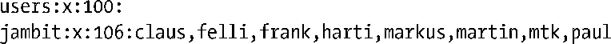
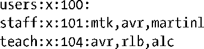

### 8.3　组文件：/etc/group

出于各种管理方面的考虑，尤其是要控制对文件和其他系统资源的访问，对用户进行编组极具实用价值。

对用户所属各组信息的定义由两部分组成：一，密码文件中相应用户记录的组ID字段；二，组文件列出的用户所属各组。这种将信息分置于两个文件中的奇怪现状，自有其历史渊源。在早期UNIX实现中，一个用户同时只能从属于一个组。登录时，用户最初的属组关系由密码文件的组ID字段决定，在此之后，可使用newgrp(1)命令去改变用户属组，但需要用户提供组密码（若该组处于密码的保护之下）。4.2BSD引入了并发多属组（multiple simultaneous group memberships）的概念，POSIX.1-1990随后对其进行了标准化。采用这种方案，组文件会列出每个用户所属的其他属组。（groups(1)命令会显示当前shell进程所属各组的信息，如果将一个或多个用户名作为其命令行参数，那么该命令将显示相应用户所属各组的信息。）

系统中的每个组在组文件/etc/group中都对应着一条记录。每条记录包含4个字段，之间以冒号分隔，如下所示：

本节将依次介绍这4个字段。

+ 组名：组的名称。与密码文件中的登录名相似，可以将其视为与数值型组标识符相对应的人类可读（符号）标识符。
+ 经过加密处理的密码：组密码属于非强制特性，对应于该字段。随着多属组的出现，当今的UNIX系统已经很少使用组密码。不过，依然可以为组设置密码（特权用户可使用gpasswd命令来设置组密码）。如果用户并非某组的成员，那么在使用newgrp(1)启动新shell之前（新shell的属组包括该组），就需要用户提供此密码。如果启用了shadow密码，那么系统将不解析该字段（这时，该字段通常只包含字母x，但也允许其内容为包括空字符串在内的任何字符串），而经过加密的密码实际上则存放于shadow组文件/etc/gshadow中，仅供具有特权的用户和程序访问。组密码的加密方式类似于用户密码（8.5节）。
+ 组ID（GID）：该组的数值型ID。正常情况下，对应于组ID号0，只定义一个名为root的组（与/etc/passwd中用户ID为0的记录相近）。在Linux 2.2或更早的版本中，组ID为16位值，其范围为0～65535；而自Linux 2.4以后的版本则以32位值来存储组ID。
+ 用户列表：属于该组的用户名列表，之间以逗号分隔。（这份列表包含的是用户名，而非用户ID，原因在于如前所述，在密码文件的各条记录中，用户ID并不一定唯一。）

为了证明用户avr是users、staff以及teach各组的成员，应能从密码文件中查看到如下记录：

且在组文件中应有如下记录：

在密码文件记录的第4个字段中，组ID为100，这说明avr是users组的成员之一。其他属组关系，则见诸于组文件内包含avr的各条相关记录。

