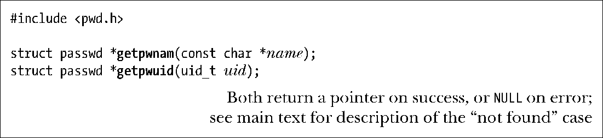
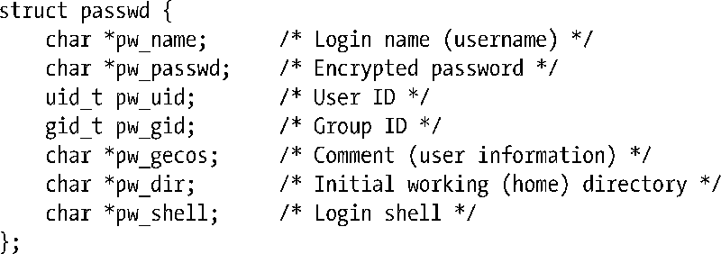
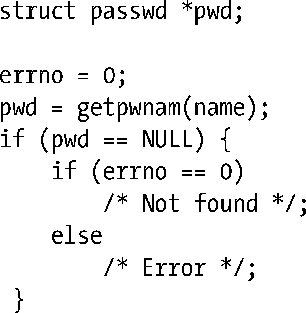

### 从密码文件获取记录

函数getpwnam()和getpwuid()的作用是从密码文件中获取记录。

为name提供一个登录名，getpwnam()函数就会返回一个指针，指向如下类型的结构，其中包含了与密码记录相对应的信息：

passwd结构的 pw_gecos 和 pw_passwd 字段虽未在 SUSv3 中定义，但获得了所有 UNIX实现的支持。仅当未启用shadow密码的情况下，pw_passwd字段才会包含有效信息。要确定是否启用了shadow密码，最简单的编程方法是在成功调用getpwnam()之后，紧接着调用getspnam()（稍后介绍），并观察后者是否能为同一用户名返回一条shadow密码记录。某些其他实现还会在该结构中定义额外的非标准字段。

> pw_gecos 字段，其命名源于早期的 UNIX 实现，该字段所含信息原用于与运行GECOS（通用电器综合操作系统）的计算机进行通信。虽然这一用途早已过时，但其名称却得以沿用至今，只是将字段用途转而用于记录用户的相关信息。

函数getpwuid()的返回结果与getpwnam()完全一致，但会使用提供给uid参数的数值型用户ID作为查询条件。

getpwnam()和getpwuid()均会返回一个指针，指向一个静态分配的结构。对此二者（或是下文描述的getpwent()函数）的任何一次调用都会改写该数据结构。

> 由于 getpwnam()和 getpwuid()返回的指针指向由静态分配而成的内存，故而二者都是不可重入的（not reentrant）。实际上，情况甚至要更加复杂，因为返回的passwd结构还包含了指向其他信息（比如，pw_name）的指针，而这些信息同样也是由静态分配而成的。21.1.2节会解释可重入（reentrancy）概念。类似的论断同样适用于 getgrnam()和getgrgid()函数（稍后介绍）。
> SUSv3 为该组函数定义了与之等价的一组可重入函数：getpwnam_r()、getpwuid_r()、getgrnam_r()以及getgrgid_r()。其参数包括passwd（或group）结构，以及一个缓冲区。这一缓冲区专门用来保存passwd(group)结构中各字段所指向的其他结构。可使用系统函数sysconf(_SC_GETPW_R_SIZE_MAX)（若为与组相关的函数，则使用 sysconf(_SC_GETGR_R_SIZE_MAX)），来获得此缓冲区所需的字节数。以上函数的详细信息请查阅手册页。

SUSv3规定，如果在 passwd 文件中未发现匹配记录，那么 getpwnam()和 getpwuid()将返回NULL，且不会改变errno。这意味着，可以使用如下代码，对出错和“未发现匹配记录”这两种情况加以区分：

然而，不少UNIX实现在这一点上并未遵守SUSv3规范。如果未能在passwd文件中发现一条匹配记录，那么两个函数均会返回 NULL，并将 errno 设置为非零值，比如，ENOENT或ESRCH。针对这种情况，2.7版本之前的glibc会产生ENOENT错误，而从2.7版本开始，glibc开始遵守SUSv3规范。实现之间之所以存在上述差异，部分原因是由于POSIX.1-1990不但不要求两个函数在出错时设置errno，而且还允许它们针对“未发现匹配记录”的情况去设置errno。总而言之，在使用这两个函数时，若要区分上述这两种情况（出错和“未发现匹配记录”），实际上将无法保证代码的可移植性。

