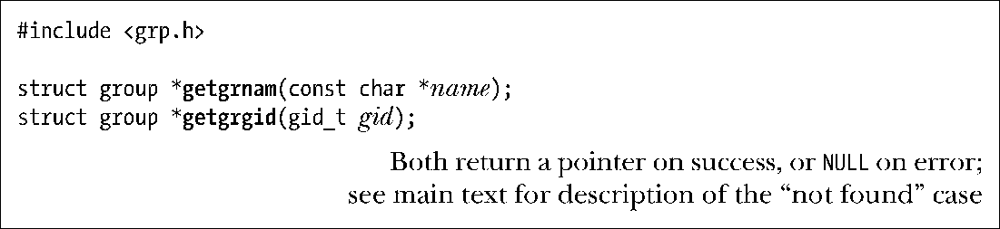
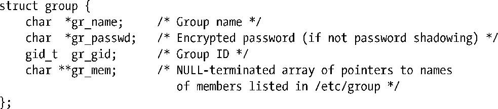

### 从组文件获取记录

函数getgrnam()和getgrgid()的作用是从组文件中获取记录。

函数getgrnam()和getgrgid()分别通过组名和组ID来查找属组信息。两个函数都会返回一个指针，指向如下类型结构：

> SUSv3并未就group结构中的gr_passwd字段做明确定义，但大多数UNIX实现都支持该字段。

与前述密码相关函数一样，对这两个函数的任何一次调用都会改写该结构的内容②。

如果未能在group文件中发现匹配记录，那么这两个函数的行为变化与前述getpwnam()和getpwuid()函数相同③。

