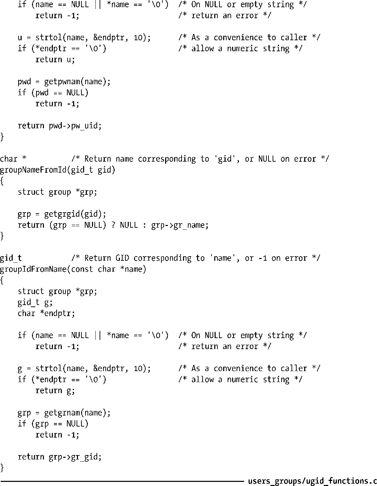

### 程序示例

对本节所述的函数来说，最常见的用法之一是在符号型用户名和组名与数值型ID之间进行相互转换。程序清单 8-1 以 userNameFromId()、userIdFromName()、groupNameFromId()以及groupIdFromName()这4个函数的形式，演示了上述转换。为方便调用，userIdFromName()和groupIdFromName()还允许name参数接受（纯）数值的字符串形式④。对于这种情况，会直接将字符串转换为数字返回给调用者。在本书后面的一些程序实例中，还会用到这几个函数。

程序清单8-1：在用户名/组名和用户ID/组ID之间互相转换的函数

