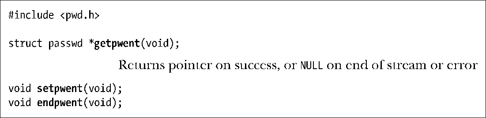
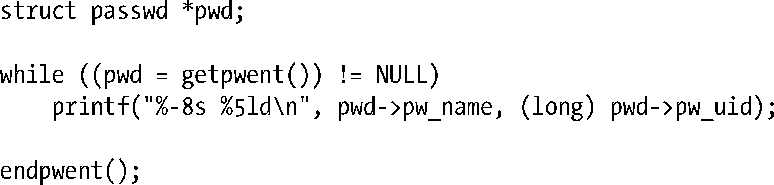

### 扫描密码文件和组文件中的所有记录

函数setpwent()、getpwent()和endpwent()的作用是按顺序扫描密码文件中的记录。

函数getpwent()能够从密码文件中逐条返回记录，当不再有记录⑤（或出错）时，该函数返回NULL。getpwent()一经调用，会自动打开密码文件。当密码文件处理完毕后，可调用endpwent()将其关闭。

可使用以下代码遍历整个密码文件，并打印出登录名和用户ID。

如果需要让后续的 getpwent()调用（也许是在程序的其他代码中，也许是在所调用的其他库函数中，该函数再次出现）再次打开密码文件并重启扫描过程，此处的endpwent()调用就必不可少。此外，如果对该文件处理到中途时，还可以调用setpwent()函数重返文件起始处。

函数getgrent()、setgrent()和endgrent()针对组文件执行类似的任务。由于这3个函数与前述的密码文件函数功能相似，故而其函数原型也就不再列出，详细信息请参考手册页。

