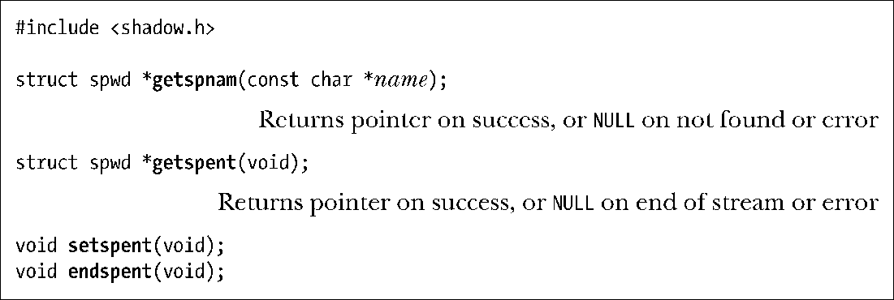

### 从shadow密码文件中获取记录

下列函数的作用包括从shadow密码文件中获取个别记录，以及扫描该文件中的所有记录。

由于上述函数在操作上类似于相应的密码文件函数，故而此处对它们的介绍也就点到为止。（上述函数既未在SUSv3中明确定义，也未获得所有UNIX实现的支持。）

函数getspnam()和getspent()会返回指向spwd类型结构的指针。该结构的形式如下：

在程序清单8-2中，将会演示对getspnam()的使用。

