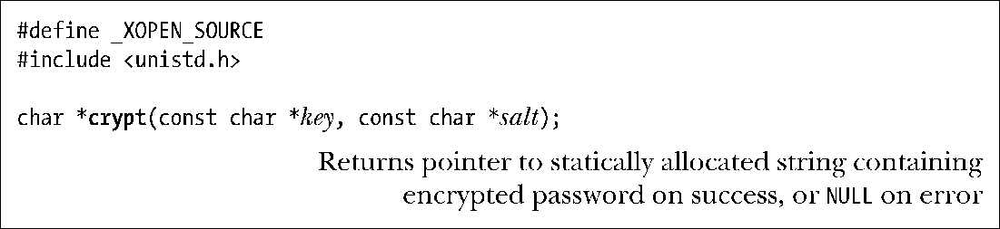

### 8.5　密码加密和用户认证

某些应用程序会要求用户对自身进行认证，通常会采取用户名（登录名）/密码的认证方式。出于这一目的，应用程序可能会维护其自有的用户名和密码数据库。然而，或许是由于势所必然，或许是为了方便起见，有时需要让用户输入标准的用户名/密码（定义于/etc/passwd和/etc/shadow之中）。（本节的剩余部分将假定系统启用了shadow密码，经过加密处理的密码也因此存储于/etc/shadow 中。）需要登录到远程系统的网络应用程序，诸如ssh和ftp，就是此类程序的典范，必须按标准的login程序那样，对用户名和密码加以验证。

由于安全方面的原因，UNIX 系统采用单向加密算法对密码进行加密，这意味着由密码的加密形式将无法还原出原始密码。因此，验证候选密码的唯一方法是使用同一算法对其进行加密，并将加密结果与存储于/etc/shadow中的密码进行匹配。加密算法封装于crypt()函数之中。

crypt()算法会接受一个最长可达8字符的密钥（即密码），并施之以数据加密算法（DES）的一种变体。salt参数指向一个两字符的字符串，用来扰动（改变）DES算法，设计该技术，意在使得经过加密的密码更加难以破解。该函数会返回一个指针，指向长度为13个字符的字符串，该字符串为静态分配而成，内容即为经过加密处理的密码。

> DES的详细信息请参考http://www.itl.nist.gov/fipspubs/fip46-2.htm。如前所述，除DES以外，也可以使用其他的加密算法。例如，使用MD5算法可以生成一个34字符的字符串，其首字符为美元符号（$），这便于让crypt()将DES加密密码和MD5加密密码区分开来。
> 在关于密码加密的讨论中，本书对“加密”一词的使用相对宽松。确切说来，DES会以给定的密码字符串作为加密密钥，编码得出固定位长的字符串，而MD5则是一种复杂的哈希函数。以上两种方法其实殊途同归，对输入密码的加密变换既不可逆又难以破解。

salt参数和经过加密的密码，其组成成员均取自同一字符集合，范围在[a-zA-Z0-9/.]之间，共计64个字符。因此，两个字符的salt参数可使加密算法产生4096（64×64）种不同变化。这意味着，预先对整部字典进行加密，再以其中的每个单词与经过加密处理的密码进行比对的做法并不可行，破解程序需要对照字典的4096种加密版本来检查密码。

由crypt()所返回的经过加密的密码中，头两个字符是对原始salt值的拷贝。也就是说，加密候选密码时，能够从已加密密码（存储于/etc/shadow 内）中获取salt值。（加密新密码时，passwd(1)这样的程序会生成一个随机salt值。）事实上，在salt字符串中，只有前两个字符对crypt()函数有意义。因此，可以直接将已加密密码指定为salt参数。

要想在Linux中使用crypt()，在编译程序时需开启–lcrypt选项，以便程序链接crypt库。

