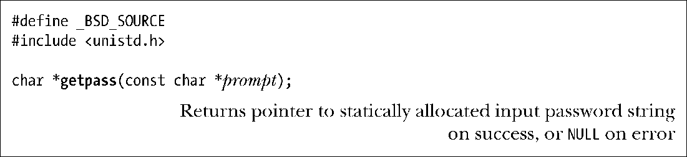
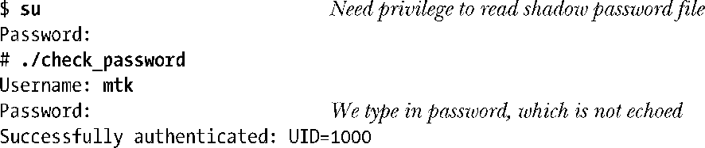
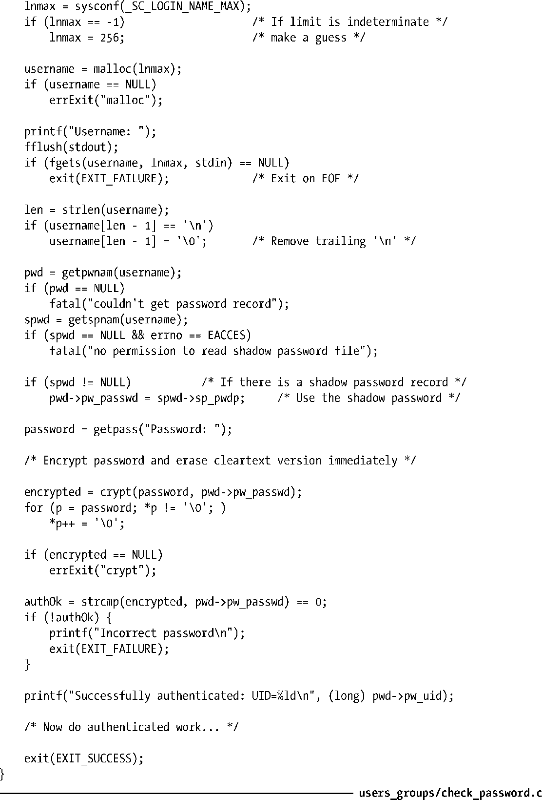

### 程序示例

程序清单8-2演示了如何使用crypt()来验证用户。该程序首先读取用户名，然后会获取相应的密码记录以及（如开启了shadow密码功能）shadow密码记录。若未能发现密码记录，或程序没有权限读取shadow密码文件（需要超级用户权限，或具有shadow组成员资格），该程序会打印一条错误消息并退出。接下来，该程序会使用getpass()函数，读取用户密码。

getpass()函数首先会屏蔽回显功能，并停止对终端特殊字符的处理（诸如中断字符，一般为Control-C）。（第62章将论述如何更改这些终端设置。）然后，该函数会打印出prompt所指向的字符串，读取一行输入，返回以NULL结尾的输入字符串（剥离尾部的换行符）作为函数结果。（该字符串由静态分配而成，故而后续对 getpass()的调用会覆盖其原有内容。）返回结果之前，getpass()会将终端设置还原。

使用getpass()读取密码之后，程序清单8-2所示程序会对密码进行验证——使用crypt()加密密码，并将结果与 shadow 密码文件中经过加密的密码记录进行比对。若两者匹配，则显示用户ID，如下所示：

> 程序清单8-2中，以调用sysconf(_SC_LOGIN_NAME_MAX)的返回值作为存放用户名字符串数组的大小，该调用获取了主机系统上用户名字符串的最大长度。11.2节将介绍sysconf()的使用。

程序清单8-2：根据shadow密码文件验证用户

程序清单8-2展示了一个安全要点。读取密码的程序应立即加密密码，并尽快将密码的明文从内存中抹去。只有这样，才能基本杜绝如下事件的发生：恶意之徒借程序崩溃之机，读取内核转储文件以获取密码。

> 仍有可能采用其他方法曝光未经加密的密码。例如，如果包含密码的虚拟内存页执行了换出操作，那么特权级程序就能交换文件中读取密码。此外，拥有足够权限的进程可通过读取/dev/mem（虚拟设备之一，将计算机物理内存表示为有序字节流），来尝试发现密码。
> SUSv2将getpass()函数标记为LEGACY，并特别指出该函数名容易产生误导，且其所提供的功能无论在何种情况下都极易于实现。SUSv3摒弃了getpass()，但在大多数UNIX实现中依然保留了对它的支持。

