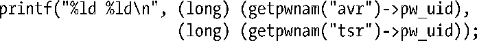

### 8.7　练习

**8-1.** 　执行下列代码时，将会发现，尽管这两个用户在密码文件中对应不同的ID，但该程序的输出还是会将同一个数字显示两次。请问为什么？

**8-2.** 　使用setpwent()、getpwent()和endpwent()来实现getpwnam()。

①译者注：此处有误，未考虑启用shadow密码的情况。

②译者注：该结构也是由静态分配而成。

③译者注：换言之，区分出错和“未发现匹配记录”情况的编程手法也与之类似。

④译者注：例如“123”。

⑤译者注：即抵达流末端时。

