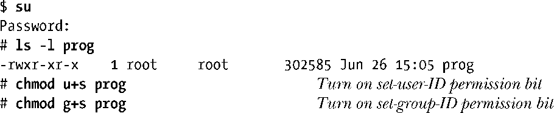
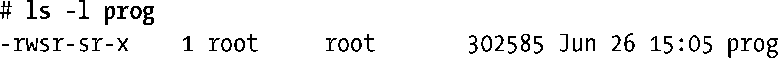
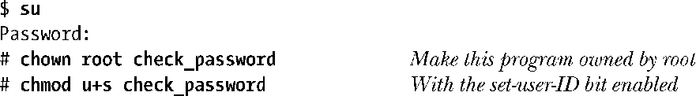
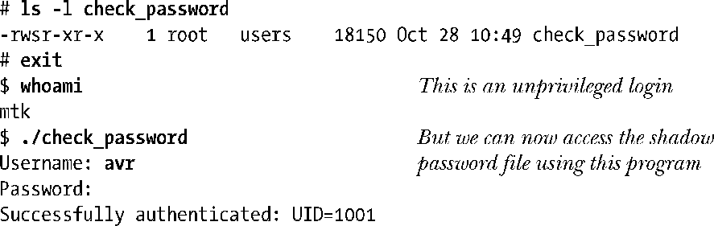

### 9.3　Set-User-ID和Set-Group-ID程序

set-user-ID程序会将进程的有效用户ID置为可执行文件的用户ID（属主），从而获得常规情况下并不具有的权限。set-group-ID程序对进程有效组 ID 实现类似任务。（术语set-user-ID程序和set-group-ID程序有时也简称为set-UID程序和set-GID程序。）

与其他文件一样，可执行文件的用户ID和组ID决定了该文件的所有权。另外，可执行文件还拥有两个特别的权限位set-user-ID位和set-group-ID位。（实际上，任何文件都是如此，但此处只关注可执行文件的这两个权限位。）可使用chmod命令来设置这些权限位。非特权用户能够对其拥有的文件进行设置，而特权级用户（CAP_FOWNER）能够对任何文件进行设置。例如：

正如本例所示，也有可能对这两个权限位都进行设置，虽然这一做法并不常见。当使用ls –l 命令查看文件权限时，如果为程序设置了set-user-ID权限位和set-group-ID权限位，那么通常用来表示文件可执行权限的x标识会被s标识所替换。

当运行set-user-ID程序（即通过调用exec()将set-user-ID程序载入进程的内存中）时，内核会将进程的有效用户ID设置为可执行文件的用户ID。set-group-ID程序对进程有效组ID的操作与之类似。通过这种方法修改进程的有效用户ID或者组ID，能够使进程（换言之，执行该程序的用户）获得常规情况下所不具有的权限。例如，如果一个可执行文件的属主为root（超级用户），且为此程序设置了set-user-ID权限位，那么当运行该程序时，进程会取得超级用户权限。

也可以利用程序的set-user-ID和set-group-ID机制，将进程的有效ID修改为root之外的其他用户。例如，为提供对一个受保护文件（或其他系统资源）的访问， 采用如下方案就绰绰有余：创建一个具有对该文件访问权限的专用用户（组）ID，然后再创建一个set-user-ID（set-group-ID）程序，将进程有效用户（组）ID变更为这个专用ID。这样，无需拥有超级用户的所有权限，程序就能访问该文件。

有时会使用术语set-user-ID-root来表示root用户所拥有的set-user-ID程序，以示与由其他用户所拥有的set-user-ID程序有所区别，后者仅为进程提供其属主所具有的权限。

> 术语privileged（特权级）有两种不同含义，其一是为早期定义而成的，有效用户ID为0的进程，拥有root用户的所有特权。然而，当set-user-ID程序的属主并非root用户时，进程也会获得set-user-ID程序属主的特权。各种情况下术语 privileged的具体含义，可通过上下文来加以辨别。
> 出于38.3节所给出的理由，在Linux系统中，set-user-ID和set-group-ID权限位对shell脚本无效。

Linux系统中经常使用的set-user-ID程序包括：passwd(1)，用于更改用户密码；mount(8) 和umount(8)，用于加载和卸载文件系统；su(1)，允许用户以另一用户的身份运行shell。set-group-ID程序的例子之一为wall(1)，用来向tty组下辖的所有终端（通常情况下，所有终端都属于该组）写入一条消息。

8.5节曾特别指出，程序清单8-2中的程序需要以root用户身份运行，以便获取对/etc/shadow 文件的访问权限。欲使该程序可为任一用户执行，必须将其设置为set-user-ID-root程序，如下所示：

set-user-ID/set-group-ID 技术集实用性与强大的功能于一身，但一旦设计欠佳也可能造成安全隐患。第38章总结了一整套良好的编程习惯，编写set-user-ID和set-group-ID程序时应多加参考。

