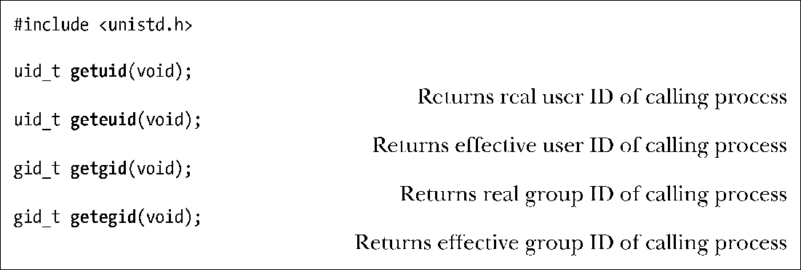
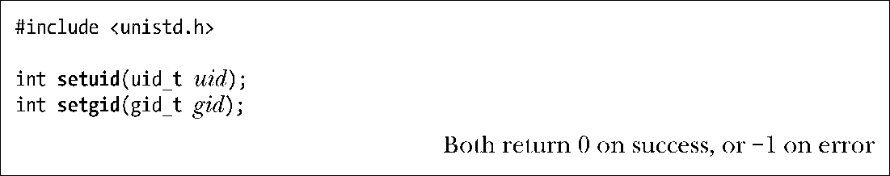
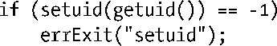
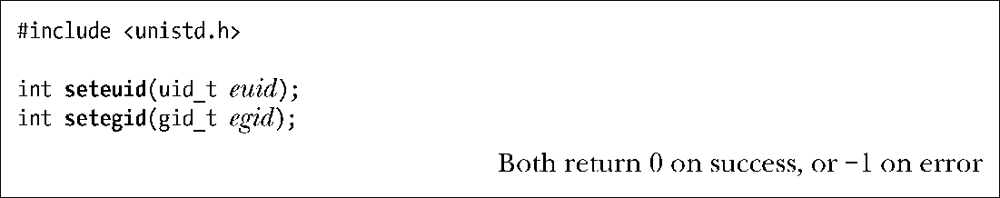
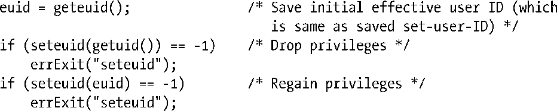
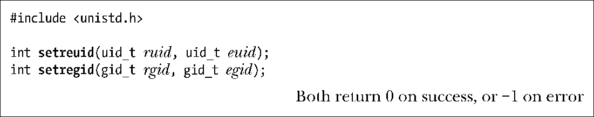
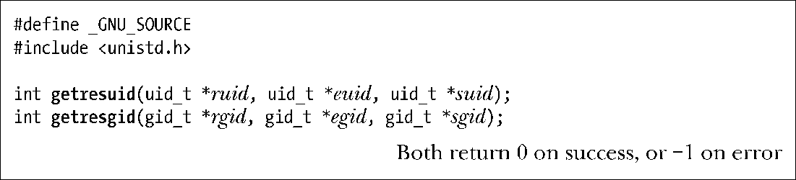

### 9.7.1　获取和修改实际、有效和保存设置标识

下面段落将描述用于获取和修改实际、有效和保存设置ID的系统调用。能完成这些任务的系统调用有多个，有时彼此间的功能还相互重叠，这是由于各种系统调用分别源于不同的UNIX实现。

##### 获取实际和有效ID

系统调用getuid()和getgid()分别返回调用进程的实际用户ID和组ID。而系统调用geteuid()和getegid()则对进程的有效ID实现类似功能。对这些系统函数的调用总会成功。

##### 修改有效ID

setuid()系统调用以给定的uid参数值来修改调用进程的有效用户ID，也可能修改实际用户ID和保存set-user-ID。系统调用setgid()则对相应组I实现了类似功能。

进程使用 setuid()和 setgid()系统调用能对其凭证做哪些修改呢？其规则取决于进程是否拥有特权（即有效用户ID为0）。适用于setuid()系统调用的规则如下。

**1．** 当非特权进程调用setuid()时，仅能修改进程的有效用户ID。而且，仅能将有效用户ID修改成相应的实际用户ID或保存set-user-ID。（企图违反此约束将引发EPERM错误。）这意味着，对于非特权用户而言，仅当执行set-user-ID程序时，setuid()系统调用才起作用，因为在执行普通程序时，进程的实际用户ID、有效用户ID和保存set-user-ID三者之值均相等。在一些派生自BSD的实现中，非特权进程对setuid() 或setgid()的调用，其语义有别于与其他UNIX实现：系统调用会修改实际、有效和保存设置ID（将其改为当前的实际或有效ID值）。

**2．** 当特权进程以一个非0参数调用 setuid()时，其实际用户ID、有效用户ID和保存set-user-ID均被置为uid参数所指定的值。这一操作是单向的，一旦特权进程以此方式修改了其ID，那么所有特权都将丢失，且之后也不能再使用setuid()调用将有效用户ID重置为0。如果不希望发生这种情况，请使用稍后介绍的seteuid()或者setreuid()系统调用来替代setuid()。

使用setgid()系统调用修改组ID的规则与之相类似，仅需要把setuid()替换为setgid()，把用户替换为组。因之，规则1与前述完全一致，但在规则2中，由于对组ID的修改不会引起进程特权的丢失（拥有特权与否由有效用户ID决定），特权级程序可以使用setgid()对组ID进行任意修改。

对set-user-ID-root程序（即其有效用户ID的当前值为0）而言，以不可逆方式放弃进程所有特权的首选方法是使用下面的系统调用（以实际用户ID值来设置有效用户ID和保存set-user-ID）。

set-user-ID程序的属主如果不是root用户，可使用setuid()将有效用户ID在实际用户ID和保存set-user-ID之间来回切换，其理由已在9.4节中予以阐述。然而，使用seteuid()来达成这个目的则更为可取，因为无论set-user-ID程序是否属于root用户，seteuid()都能够实现同样的功能。

进程能够使用seteuid()来修改其有效用户ID（改为参数euid所指定的值），还能使用setegid()来修改其有效组ID（改为参数egid所指定的值）。

进程使用seteuid()和setegid()来修改其有效ID时，会遵循以下规则。

**1．** 非特权级进程仅能将其有效ID修改为相应的实际ID或者保存设置ID。（换言之，对非特权级进程而言，除去前面讨论的BSD可移植性问题，seteuid()和setegid()分别等效于setuid()和setgid()。）

**2．** 特权级进程能够将其有效ID修改为任意值。若特权进程使用seteuid()将其有效用户ID修改为非0值，那么此进程将不再具有特权（但可以根据规则1来恢复特权）。

对于需要对特权“收放自如”的set-user-ID和set-group-ID程序，更推荐使用seteuid()，示例如下：

源于BSD系统的seteuid() 和 setegid()，现已纳入SUSv3规范，并获得大多数UNIX系统实现的支持。

> 在GNU C语言函数库的早期版本中（glibc 2.0及其之前的版本），将seteuid(euid)实现为setreuid(–1, euid)。而在新版的glibc库中，则将seteuid(euid)实现为setresuid(–1，euid，−1)。（稍后将给出对setreuid()、setresuid()及其类似函数的描述。）这两种实现都允许将euid参数值指定为当前有效用户ID（即保持不变）。然而，SUSv3并未对seteuid()的这个行为进行规范，并且其他一些UNIX实现对此也不支持。总的来说，这种潜在的差异在系统实现间并不明显，因为在通常情况下，有效用户ID要么与实际用户ID相同，要么与保存set-user-ID相同。（要想使有效用户ID与二者均不相同，在Linux系统中唯一的办法是采用非标准的setresuid()系统调用。）
> 在glibc库的所有版本（包括最新版本）中，是以setregid(–1，egid)来实现setegid(egid)的。如同 seteuid()一样，这意味着能够将参数egid指定为当前有效组ID，尽管SUSv3并未规范这一行为。还有一层含义是使用setegid()时，如果对有效组ID值的设置不同于当前的实际组ID，那么还将改变保存set-group-ID。（类似结论也适用于早期使用setreuid()来实现的seteuid()。）同样，SUSv3也不支持这一行为。

##### 修改实际ID和有效ID

setreuid()系统调用允许调用进程独立修改其实际和有效用户ID。setregid()系统调用对实际和有效组ID实现了类似功能。

这两个系统调用的第一个参数都是新的实际ID，第二个参数都是新的有效ID。若只想修改其中的一个ID，可以将另外一个参数指定为−1。

目前，最初派生自BSD的setreuid()和setregid()为SUSv3规范所接纳，并且获得了大多数UNIX系统的支持。

同本节介绍的其他系统调用一样，使用setreuid()和setregid()来作出变更也要遵循一定的规则。下面将从setreuid()的视角来描述这些规则，除非另有说明，setregid()函数的规则也与之类似。

**1．** 非特权进程只能将其实际用户ID设置为当前实际用户ID值（即保持不变）或有效用户ID值，且只能将有效用户ID设置为当前实际用户ID、有效用户ID（即无变化）或保存set-user-ID。

> SUSv3声称，对于非特权进程是否能使用setreuid()将其实际用户ID修改为实际用户ID、有效用户ID或者保存set-user-ID的当前值，规范不做规定。至于真正能将实际用户ID修改成何值，这随UNIX实现的不同而不同。
> SUSv3 对 setregid()的规定稍有不同，非特权进程能够将其实际组 ID 设置为保存set-group-ID的当前值，或者将其有效组ID设置为实际组ID或保存set-group-ID的当前值。但真正能对实际组ID做哪些修取决于具体的UNIX实现。

**2．** 特权级进程能够设置其实际用户ID和有效用户ID为任意值。

**3．** 不管进程拥有特权与否，只要如下条件之一成立，就能将保存set-user-ID设置成（新的）有效用户ID。

a）ruid不为-1（即设置实际用户ID，即便是置为当前值）。

b）对有效用户ID所设置的值不同于系统调用之前的实际用户ID。

反过来说，如果进程使用setreuid()仅将有效用户ID修改为实际用户ID的当前值，那么保存set-user-ID的值将保持不变，并且后续可调用setreuid()（或seteuid()）将有效用户ID恢复为保存set-user-ID的值。（setreuid()和setregid()针对保存设置ID的这一效果，SUSv3未做规定，但已被SUSv4纳入规范。）

规则3为set-user-ID程序提供了一个永久放弃特权的方法，使用如下调用：

set-user-ID-root进程若有意将用户凭证和组凭证改变为任意值，则应首先调用setregid()，然后再调用setreuid()。一旦调用顺序颠倒，那么调用setregid()将会失败，因为调用setreuid()后，程序将不再具有特权。若使用 setresuid()和 setresgid()（详见下述）来实现此功能，上述描述也同样适用。

> 直至4.3BSD，BSD发行版都不支持保存set-user-ID和保存set-group-ID（如今已为SUSv3强制要求支持）。相反，在BSD中，setreuid()和setregid()允许进程通过来回交换实际ID和有效ID来“收、放”特权。这一方式的不良副作用在于为了改变有效用户ID而改变实际用户ID。

##### 获取实际、有效和保存设置ID

在大多数UNIX实现中，进程不能直接获取（或修改）其保存 set-user-ID 和保存set-group-ID的值。然而，Linux提供了两个（非标准的）系统调用来实现此项功能：getresuid() 和 getresgid()。

getresuid()系统调用将调用进程的当前实际用户ID、有效用户ID和保存set-user-ID值返回至给定3个参数所指定的位置。getresgid()系统调用针对相应的组ID实现了类似功能。

##### 修改实际、有效和保存设置ID

setresuid()系统调用允许调用进程独立修改其3个用户ID的值。每个用户ID的新值由系统调用的3个参数给定。setresgid()系统调用对相应的组ID实现了类似功能。

若不想同时修改这些ID，则需将无意修改的ID参数值指定为-1。例如，下列调用等同于seteuid(x)调用：

关于setresuid()可做何种修改的规则（setresgid()与之类似）如下所示。

**1．** 非特权进程能够将实际用户ID、有效用户ID和保存set-user-ID中的任一ID设置为实际用户ID、有效用户ID或保存set-user-ID之中的任一当前值。

**2．** 特权级进程能够对其实际用户ID、有效用户ID和保存set-user-ID做任意设置。

**3．** 不管系统调用是否对其他ID做了任何改动，总是将文件系统用户ID设置为与有效用户ID（可能是新值）相同。

setresuid()和setresgid()调用具有0/1效应，即对ID的修改请求要么全都成功，要么全部失败。（这也适用于本章所述其他修改多个ID的系统调用。）

虽然setresuid()和setresgid()为修改进程凭证提供了最为直接的API，但在应用程序中采用这些调用会带来可移植性问题。SUSv3规范并未包括这些调用，且其他UNIX实现对其也鲜有支持。

