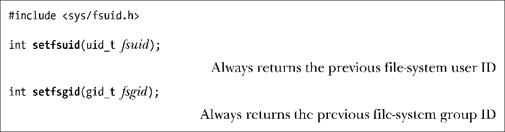

### 9.7.2　获取和修改文件系统ID

前述所有修改进程有效用户ID或组ID的系统调用总是会修改相应的文件系统ID。要想独立于有效 ID 而修改文件系统 ID，必须使用Linux特有的系统调用：setfsuid() 和 setfsgid()。

setfsuid()系统调用将进程文件系统用户ID修改为参数fsuid所指定的值。setfsgid()系统调用将文件系统组ID修改为参数fsgid所指定的值。

同样，此类变更也存在一些规则。setfsgid()的规则类似于setfsuid()，下面以setfsuid()为例。

**1．** 非特权进程能够将文件系统用户ID设置为实际用户ID、有效用户ID、文件系统用户ID（即保持不变）或保存set-user-ID的当前值。

**2．** 特权级进程能够将文件系统用户ID设置为任意值。

这些系统调用的实现存在一些瑕疵。首先，没有相应的系统调用来获取当前的文件系统ID。另外，这些系统调用根本不做错误检查。一旦非特权进程试图将文件系统ID设置为一个非法值，这一不轨企图也只是被静默地忽略掉。无论这些调用成功与否，其返回值都是之前相关文件系统的ID。因此，这确实也是一种获得当前文件系统ID的方法，但却只能是在尝试修改这些值（不管是否成功）的同时进行。

在Linux系统中，使用 setfsuid()和 setfsgid()系统调用已不是必要的，若需要将应用程序移植到其他UNIX实现上，则应在设计时避免使用这两个调用。

