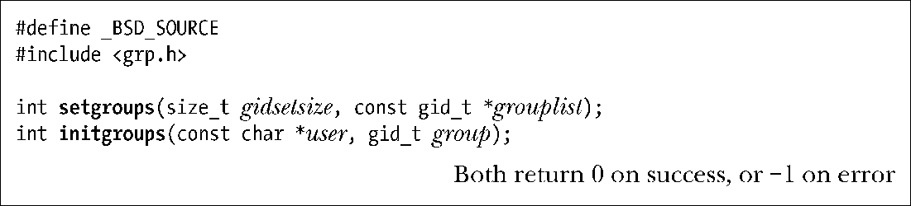

### 9.7.3　获取和修改辅助组ID

getgroups()系统调用会将当前进程所属组的集合返回至由参数grouplist指向的数组中。

像大多数UNIX实现一样，Linux中的getgroups()仅返回调用进程的辅助组ID。然而，SUSv3规范还允许UNIX实现在返回的grouplist中包含调用进程的有效组ID。

调用程序必须负责为grouplist数组分配存储空间，并在gidsetsize参数中指定其长度。若调用成功，getgroups()会返回置于grouplist中的组ID数量。

若进程属组的数量超出gidsetsize，则getgroups()将返回错误(错误号为EINVAL)。为了避免发生这种情况，可将grouplist数组的大小调整为常量NGROUPS_MAX+1（考虑到可移植性，数组中可能包含了有效组ID），该常量（定义于<limits.h>文件中）定义了进程属组的最大数量。因此，可声明grouplist如下：

在Linux内核版本2.6.4之前，NGROUPS_MAX的值为32。始于内核版本2.6.4，NGROUPS_MAX的值为65536。

应用程序要在运行时获取NGROUPS_MAX的上限，还可使用如下方法。

+ 调用sysconf(_SC_NGROUPS_MAX)。（11.2节解释了sysconf()的用法。）
+ 从Linux特有的/proc/sys/kernel/ngroups_max只读文件中读取该限制。系统从内核2.6.4开始提供该文件。

除此之外，应用程序还能在调用getgroups()时将gidtsetsize参数指定为0。这样一来，grouplist数组未作修改，但调用的返回值却给出了进程属组的数量。

通过上述任意一种运行时技术所获取的 NGROUPS_MAX 值，可用于为后续的getgroups()调用动态分配grouplist数组。

特权级进程能够使用setgroups()和initgroups()来修改其辅助组ID集合。

setgroups()系统调用用grouplist数组所指定的集合来替换调用进程的辅助组ID。参数gidsetsize指定了置于参数grouplist数组中的组ID数量。

initgroups()函数将扫描/etc/groups文件，为user创建属组列表，以此来初始化调用进程的辅助组ID。另外，也会将参数group指定的组ID追加到进程辅助组ID的集合中。

initgroups()函数的主要用户是创建登录会话的程序——例如 login(1)，在用户调用登录shell之前，为进程设置各种属性。此类程序一般通过读取密码文件中用户记录的组属性来获取参数group的值。这稍微有点令人费解，因为密码文件中的组ID实际并非辅助组ID，而是定义了登录shell初始的实际组ID、有效组ID和保存set-group-ID。尽管如此，这却是initgroups()函数的常用使用方式。

虽然未纳入SUSv3，setgroups()和initgroups()却获得了所有UNIX实现的支持。

