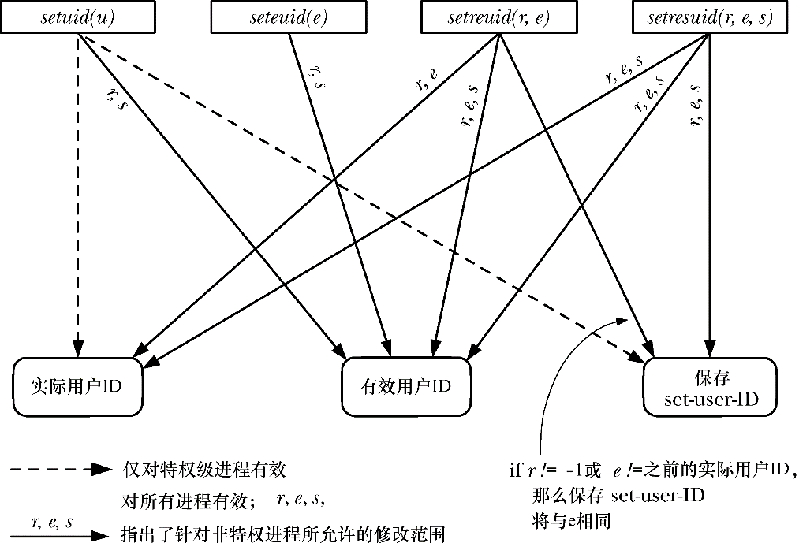

### 9.7.4　修改进程凭证的系统调用总结

表9-1对修改进程凭证的各种系统调用及库函数的效果进行了总结。

图9-1提供了表9-1中信息的概括图示。本图内容是从修改用户ID的角度加以展示的，但修改组ID的规则与之类似。

<b class="my_markdown">图9-1：凭证修改函数对进程用户ID的效果</b>

<b class="my_markdown">表9-1：修改进程凭证的接口一览表</b>

| 接　　口 | 目的和效果应用于 | 可 移 植 性 |
| :-----  | :-----  | :-----  | :-----  | :-----  |
| 非特权进程 | 特权级进程 |
| setuid(u) setgid(g) | 将有效ID修改为当前实际ID或保存设置ID | 将实际ID、有效ID和保存设置 ID 修改为任何（一个）值 | 获得SUSv3规范的支持，但BSD 的派生系统具有不同语义 |
| seteuid(e) setegid(e) | 将有效ID修改为当前的实际或保存设置ID | 修改有效ID为任意值 | 获得SUSv3规范支持v |
| setreuid(r, e) setregid(r, e) | （独立）将实际ID修改为当前实际ID或有效ID值，将有效ID修改为当前实际ID、有效ID或保存设置ID | （独立）将实际ID和有效ID修改为任意值 | 获得SUSv3规范支持，但操作随系统实现不同而不同 |
| setresuid(r, e, s) setresgid(r, e, s) | （独立）将实际ID、有效ID和保存设置ID修改为当前实际ID、有效ID或保存设置ID | （独立）将实际ID、有效ID和保存设置 ID修改为任意值 | 未获SUSv3规范支持，并且鲜见于其他UNIX实现 |
| setfsuid(u) setfsgid(u) | 将文件系统ID修改为当前实际ID、有效ID、文件系统ID或者保存设置ID | 将文件系统ID修改为任意值 | Linux系统所特有 |
| setgroups(n, 1) | 非特权进程无法调用 | 设置辅助组ID为任意值 | 未见诸于SUSv3规范，但获得所有UNIX实现的支持 |

补充说明表9-1中的信息。

+ glibc库对seteuid()(setresuid(–1，e，–1))和setegid()(setregid (–1，e，–1))函数的实现方式允许将有效ID设置为有效ID的当前值，但SUSv3对此未作规范。此外，若将有效组ID设置为当前实际组ID之外的值，那么setegid()的函数实现还会修改保存设置组ID。（对于setegid()实现这一修改保存set-group-ID的行为，SUSv3也未作规范。）
+ 针对特权级进程和非特权进程调用setreuid()和setregid()的情况，若r的值不等于−1，或者e的值有别于函数调用前的实际ID，则将保存set-user-ID或保存set-group-ID设置为（新的）有效ID。（setreuid()和setregid()函数对保存设置ID的修改未获SUSv3支持。）
+ 只要修改了有效用户（组）ID，就会将Linux特有的文件系统用户（组）ID也修改为相同值。
+ 不管有效用户 ID 是否改变，setresuid()系统调用总是把文件系统用户ID修改为有效用户ID， setresgid()系统调用对文件系统组ID的效力与之类似。

