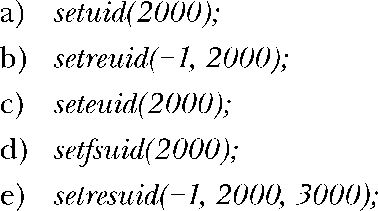

### 9.9　习题

**9-1.** 　在下列每种情况中，假设进程用户ID的初始值分别为real（实际）=1000、effective（有效）=0、saved（保存）=0、file-system（文件系统）=0。当执行这些调用后，用户ID的状态如何？



**9-2.** 　拥有如下用户ID的进程享有特权吗？请予解释。

```go
real=0 effective=1000 saved=1000 file-system=1000
```

**9-3.** 　使用setgroups()及库函数从密码文件、组文件（参见8.4节）中获取信息，以实现initgroups()。请注意，欲调用setgroups()，进程必须享有特权。


**9-4.** 　假设某进程的所有用户标识均为X，执行了用户ID为Y的set-user-ID程序，且Y为非0值，对进程凭证的设置如下：


（这里忽略了文件系统用户ID，因为该ID随有效用户ID的变化而变化。）为执行如下操作，请分别列出对setuid()、seteuid()、setreuid()和setresuid()的调用。

a）挂起和恢复set-user-ID 身份（即将有效用户ID在实际用户ID和保存set-user-ID间切换）。

b）永久放弃set-user-ID身份（即确保将有效用户ID和保存set-user-ID设置为实际用户ID）。

（该练习还需要使用getuid()和geteuid()函数来获取进程的实际用户ID和有效用户ID。）请注意，鉴于上述列出的某些系统调用，部分操作将无法实现。

**9-5.** 　针对执行set-user-ID-root程序的进程，重复上述练习，进程凭证的初始值如下：


①译者注：即标识符。

②译者注：进程。

③译者注：即属主和属组。


