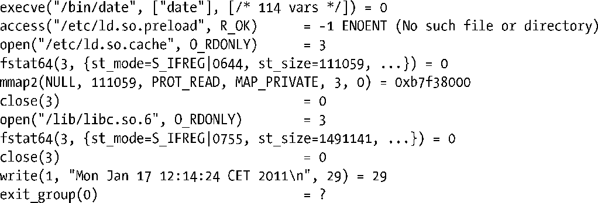

### 附录A　跟踪系统调用

strace命令允许我们跟踪程序执行的系统调用。这个功能对调试程序，或者只是简单查看程序正在做些什么都是非常有帮助的。strace最简单的用法如下。

这将以给定的命令行参数来运行该命令，产生程序所执行的系统调用跟踪。默认情况下，strace会将输出写入到stderr中，但我们可以通过-o filename的选项来修改这个行为。

以下是strace产生的输出的例子（取自命令strace date的输出）。

每个系统调用都以一个函数调用的形式显示出来，输入和输出参数都在括号中给出。从以上示例来看，参数是以符号形式打印出来的。

+ 位掩码以相应的符号常量来代表。
+ 字符串以文本形式打印出来（长度上限为32个字符，但-s strsize选项可用来更改这个上限）。
+ 结构体字段是单独显示的（默认情况下，只有大型结构体的子集缩写才会被显示出来，但是-v选项可用来显示整个结构体）。

在被跟踪调用的右括号后，strace 打印出一个等于号（=），紧跟着的是该系统调用的返回值。如果系统调用失败了，也会显示出errno错误码的符号表示。因此，在上面的access()调用中，我们看到对应的错误码ENOENT被打印了出来。

就算只是一个简单的程序，strace产生的输出也很长，因为这其中包含了 C 运行时库启动代码以及加载共享库时所执行的系统调用。对于一个复杂的程序来说，strace的输出可以相当的长。基于这些原因，有时候对 strace 的输出有选择性地做些过滤会非常有用。一种方法是利用grep，就像这样：

另一种方法是使用-e选项来选择需要跟踪的事件。比如，我们可以用如下的命令来跟踪open()和close()系统调用：

无论使用上述哪一种技术，在某些情况下我们需要注意的是：系统调用的真实名称同它对应的glibc包装函数是有区别的。比如，尽管在第26章中我们把所有的wait()-type函数都认为是系统调用，但其实它们中的大多数（wait()、waitpid()以及wait3()）都是包装函数，用来调用内核的wait4()系统调用例程。strace显示的是后者的名称，因此我们在-e trace=选项中指定的名称必须是后者。同样的，所有的exec库函数（见27.2节）都会调用execve()系统调用。通常，我们可以通过查看strace的输出对这类名称的转换做猜测（或者通过查看strace –c产生的输出，下面会描述到）。但是如果猜错了，我们就需要在glibc的源码中检查，看看在包装函数内做了些什么转换。

strace(1)用户手册页列出了strace的一些其他选项，如下所示。

+ -p pid选项通过指定进程的ID号来跟踪一个已存在的进程。非特权级用户被局限于只能跟踪它们自己，以及那些没有执行设定用户 ID 或设定组 ID 操作的程序（见9.3节）。
+ -c选项可以使strace打印出程序所执行的所有系统调用的概要。对于每个系统调用，概要信息包括总的调用次数，调用失败的次数，以及执行这些调用所花费的总时间。
+ -f选项可以使该进程的子进程也能得到跟踪。如果我们将跟踪的输出发送给一个文件（-o filename），那么可选的-ff选项能使每个进程将自己的跟踪输出写到名称形式为filename.PID的文件中。

strace命令是Linux下专有的，但大多数UNIX实现都提供了它们各自的等价物（例如，Solaris上的truss，以及BSD上的ktrace）。

> ltrace命令所执行的任务同strace类似，但它是针对库函数调用的。请参阅ltrace(1)用户手册页以获得更多细节。

