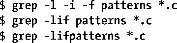
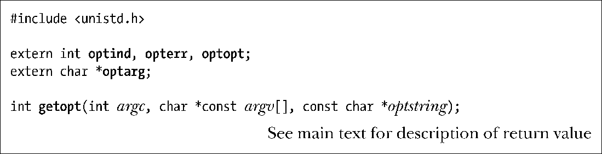
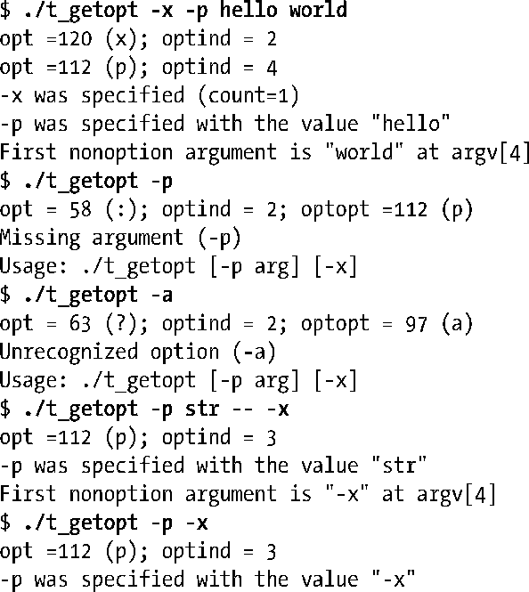
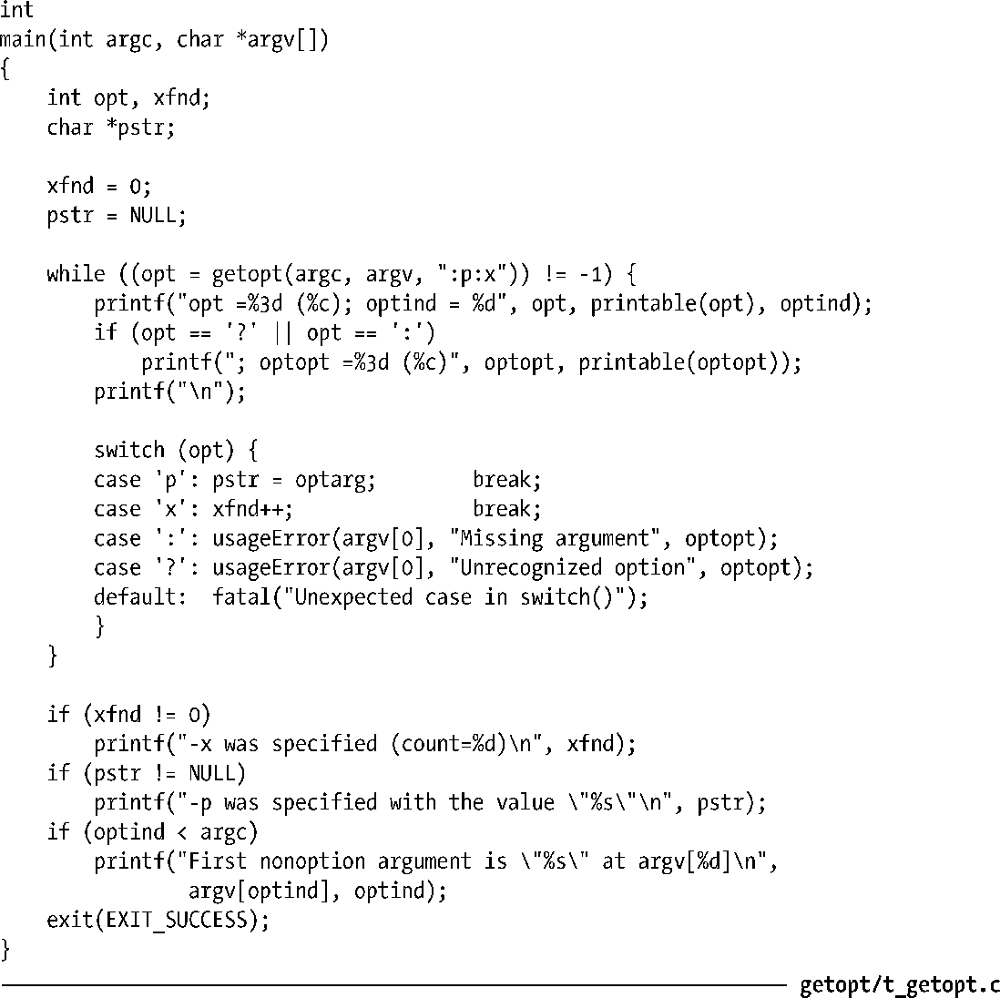
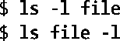
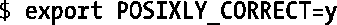

### 附录B　解析命令行选项

一个典型的UNIX命令行有着如下的形式。

选项的形式为连字符（-）紧跟着一个唯一的字符用来标识该选项，以及一个针对该选项的可选参数。带有一个参数的选项能够以可选的方式在参数和选项之间用空格分开。多个选项可以在一个单独的连字符后归组在一起，而组中最后一个选项可能会带有一个参数。根据这些规则，下面这些命令都是等同的。

在上面这些命令中，-l和-i选项没有参数，而-f选项将字符串pattern当做它的参数。

因为许多程序（包括本书中的一些示例程序）都需要按照上述格式来解析选项，相关的机制被封装在了一个标准库函数中，这就是getopt()。

函数getopt()解析给定在参数argc和argv中的命令行参数集合。这两个参数通常是从main()函数的参数列表中获取。参数optstring指定了函数getopt()应该寻找的命令行选项集合，该参数由一组字符组成，每个字符标识一个选项。SUSv3中规定了 getopt()至少应该接受62个字符[a-zA-Z0-9]作为选项。除了:、?、和-这几个对getopt()来说有着特殊意义的字符外，大多数实现还允许其他的字符也作为选项出现。每个选项字符后可以跟一个冒号字符（:），表示这个选项带有一个参数。

我们通过连续调用getopt()来解析命令行。每次调用都会返回下一个未处理选项的信息。如果找到了选项，那么代表该选项的字符就作为函数结果返回。如果到达了选项列表的结尾，getopt()就返回−1。如果选项带有参数，getopt()就把全局变量optarg设为指向这个参数。

注意 getopt()的函数返回值类型为 int。我们必须注意不能把 getopt()的返回值赋值给char类型的变量，因为当工作在char型变量是无符号整数的系统上时，char型变量同−1之间的比较操作就不会成功。

> 如果选项不带参数，那么glibc的getopt()实现（同大多数实现一样）会将optarg设为NULL。但是，SUSv3并没有对这种行为做出规定。因此基于可移植性的考虑，应用程序不能依赖这种行为（通常也不需要）。
> SUSv3中规定了一个相关的函数（且glibc也实现了）getsubopt()。该函数可以解析由1个或多个逗号相分隔的字符串所组成的参数列表，每个参数的形式为name[=value]。请参阅getsubopt(3)用户手册页以获得更多细节。

每次调用getopt()时，全局变量optind都得到更新，其中包含着参数列表argv中未处理的下一个元素的索引。（当把多个选项归组到一个单独的单词中时，getopt()内部会做一些记录工作，以此跟踪该单词，找出下一个待处理的部分。）在首次调用getopt()之前，变量optind会自动设为1。在如下两种情况中我们可能会用到这个变量。

+ 如果getopt()返回了−1，表示目前没有更多的选项可解析了，且optind的值比argc要小，那么argv[optind]就表示命令行中下一个非选项单词。
+ 如果我们处理多个命令行向量或者重新扫描相同的命令行，那么我们必须手动将optind重新设为1。

在下列情况中，getopt()函数会返回−1，表示已到达选项列表的结尾。

+ 由argc加上argv所代表的列表已到达结尾（即argv[optind]为NULL）。
+ argv中下一个未处理的单字不是以选项分隔符打头的（即，argv[optind][0]不是连字符）。
+ argv中下一个未处理的单字只由一个单独的连字符组成（即，argv[optind]为-）。有些命令可以理解这种参数，该单字本身代表了特殊的意义，见 5.11 节中的描述。
+ argv中下一个未处理的单字由两个连字符（--）组成。在这种情况下，getopt()会悄悄地读取这两个连字符，并将optind调整为指向双连字符之后的下一个单字。就算命令行中的下一个单字（在双连字符之后）看起来像一个选项（即，以一个连字符开头），这种语法也能让用户指出命令的选项结尾。比如，如果我们想利用grep在文件中查找字符串-k，那么我们可以写成grep -- -k myfile。

当getopt()在处理选项列表时，可能会出现两种错误。一种错误是当遇到某个没有指定在optstring中的选项时会出现。另一种错误是当某个选项需要一个参数，而参数却未提供时会出现（即，选项出现在命令行的结尾）。有关getopt()是如何处理并上报这些错误的规则如下。

+ 默认情况下，getopt()在标准错误输出上打印出一条恰当的错误消息，并将字符?作为函数返回的结果。在这种情况下，全局变量optopt返回出现错误的选项字符（即，未能识别出来的或缺少参数的那个选项）。
+ 全局变量opterr可用来禁止显示由getopt()打印出的错误消息。默认情况下，这个变量被设为1。如果我们将它设为0，那么getopt()将不再打印错误消息，而是表现的如同上一条所描述的那样。程序可以通过检查函数返回值是否为?字符来判断是否出错，并打印出用户自定义的错误消息。
+ 此外，还有一种方法可以用来禁止显示错误消息。可以在参数 optstring 中将第一个字符指定为冒号（这么做会重载将 opterr 设为 0 的效果）。在这种情况下，错误上报的规则同将 opterr 设为 0 时一样，只是此时缺失参数的选项会通过函数返回:来报告。如果需要的话，我们可以根据不同的返回值来区分这两类错误（未识别的选项，以及缺失参数的选项）。

上述这些可选的错误报告机制总结在了表B-1中。

<b class="my_markdown">表B-1：getopt()错误上报的几种行为</b>

| 错误上报的方法 | getopt()会显示错误消息吗？ | 针对未识别的选项产生的返回值 | 针对缺少参数产生的返回值 |
| :-----  | :-----  | :-----  | :-----  | :-----  | :-----  |
| 默认（opterr == 1） | Y | ? | ? |
| opterr == 0 | N | ? | ? |
| 在optstring中将第一个 | N | ? | : |
| 字符设为: |

#### 程序示例

程序清单B-1中的程序说明了应该如何使用getopt()来解析带有两个选项的命令行：不带参数的-x选项，以及需要一个参数的-p选项。这个程序通过在参数optstring中将:设为第一个字符从而禁止显示错误消息。

为了让我们能观察 getopt()的操作，我们在代码中包含了一些 printf()调用来打印出每次getopt()调用返回的信息。解析完成后，程序会打印出一些关于指定选项的概要信息。如果命令行上还有非选项的单字，程序也会将它们显示出来。下面的shell会话展示了当我们以不同的命令行参数运行该程序时显示的结果。

注意上面最后一个例子，字符串-x被解释为-p选项的参数了，而不是单独作为选项。

程序清单B-1：使用getopt()

#### 特定于GNU的行为

默认情况下，glibc版的getopt()实现还有一个非标准的功能：允许选项和非选项混在一起。因此，比如说下面这两种写法就是相同的。

处理第二种形式的命令行时，getopt()会将argv中的内容重排列，这样所有的选项会排列到数组的开始处，而所有的非选项会排列到数组的尾端。（如果argv中包含有一个元素指向--，那么只有位于--前面的元素会参与排列，并被解释为选项。）换句话说，前面给出的getopt()的函数原型中，参数argv前的const声明实际上在glibc中并没有得到遵守。

对argv的内容进行重排列，这在 SUSv3（或者SUSv4）中是不允许的。我们可以强制getopt()提供与标准一致的行为（即，遵守前面提到的判断选项列表是否到达结尾的规则），把环境变量 POSIXLY_CORRECT 设为任意值就能做到这点。这可以通过下面两种方法来实现。

+ 在程序中，我们可以调用 putenv()或 setenv()。这么做的优点是不需要用户做任何事。缺点是需要修改程序的源代码，而且只能修改那一个程序的行为。
+ 我们可以在执行程序前，在shell中定义条件变量。

这种方法的优点是可以影响所有使用到 getopt()的程序。但是，它也有一些缺点。POSIXLY_CORRECT会导致很多Linux下的工具行为发生改变。此外，设定这个环境变量需要用户显式进行操作（很可能在shell启动文件中设定这个变量）。

另一种防止getopt()重排列命令行参数的方法是在参数optstring中在第一个字符前增加一个加号（+）。（如果我们也希望像前面描述过的那样禁止getopt()打印错误消息，那么optstring的前两个字符就应该是+:，顺序不能改变。）由于会用到putenv()和setenv()，这种方法的缺点在于需要修改程序代码。请参阅getopt(3)用户手册页以获得更多细节。

> 未来对SUSv4的技术勘误中很可能会增加关于在optstring中使用加号来阻止对命令行参数进行重排列的规范。

我们需要注意glibc版的getopt()对参数进行重排列的行为是如何影响到shell脚本的编写的。（这会对将shell脚本从其他系统移植到Linux上的开发者产生影响。）假设我们有一个shell脚本，能对目录下所有的文件执行操作：

如果这些文件名中有一个是以连字符开头的，那么glibc版的getopt()的重排列行为会导致将这个文件名解释成命令chmod的一个选项。在其他的UNIX实现中是不会出现这个问题的，因为第一个出现的非选项（644）就能确保getopt()不会在剩下的命令行中继续寻找选项了。对于大部分的命令，（如果我们不设定POSIXLY_CORRECT）要处理这种需要运行在Linux上的shell脚本，方法是在第一个非选项参数前加上--。因此，我们应该将上面的脚本重写为：

在这个特殊的例子中，因为涉及到文件名的生成，我们可以改写为：

尽管在上面的例子中我们用到了文件名模式匹配（globbing），类似的情况也可以出现在其他的shell处理中（例如，命令替换和参数扩展），此时也可以用相似的方法，采用--将选项和参数分隔开来处理。

#### GNU扩展

GNU C函数库对getopt()提供了一些扩展，需要我们简单注意以下几点。

+ SUSv3规范允许只带有强制性参数的选项。在GNU版的getopt()中，我们可以在选项字符后放置两个冒号，以此表示这个参数是可选的。对于这样的选项，其参数必须出现在同选项一起的单字中（即，在选项和参数之间不能有空格）。如果参数不存在，那么getopt()返回后，optarg会被设为NULL。
+ 许多GNU命令都允许出现长选项语法。长选项以两个连字符开始，选项本身用一个单字来标识，而不是用单个字符来表示。如下面的例子：
+ 
+ glibc中的函数getopt_long()可以用来解析这样的选项。
+ GNU C函数库甚至提供了更为复杂（但不可移植）的API用来解析命令行，称为argp。这个API在glibc的手册中有描述。

