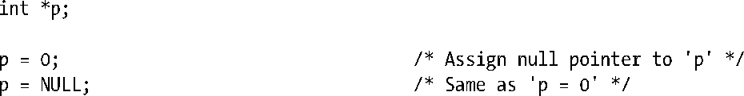
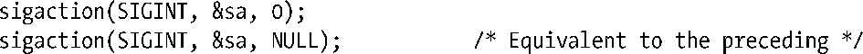
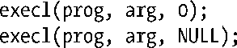
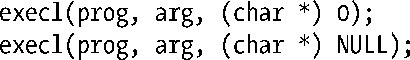

### 附录C　对NULL指针做转型

考虑如下对变参型函数execl()的调用：

变参型函数是指可接收的参数数量可变，或者参数类型可变的函数。

是否需要像上面这样对NULL做转型，常常会引起一些混乱。通常我们可以不做转型，但C标准却要求我们这么做。不做转型的话，会导致应用程序在某些系统上崩溃。

一般来说，NULL被定义为0或者(void *)0。（C标准允许其他的定义方式，但实质上都等同于这两种定义的其中之一。）需要做转型的主要原因在于NULL可以被定义为0，因此这是我们首先需要考虑的情况。

在将源码交给编译器处理之前，C预处理器会先将NULL替换为0。C标准规定常数0可以用在任何需要用到指针的上下文中，而编译器会确保将这个值看做是一个NULL指针。大多数情况下这都不会有问题，而且我们也没必要去担心转型的问题。比如，我们可以像这样编写代码：

上面的赋值语句可以正常工作，因为编译器能判断赋值语句的右侧是否需要一个指针，并且可以将0转换为一个null指针。

同样的，对于指定了定长参数列表的函数原型，我们可以将指针参数指定为0或者NULL，以此表明应该给这个函数传递一个null指针。

> 如果我们将null指针传递给一个老式的、没有函数原型的C函数，那么不管参数是否属于变长参数列表的一部分，所有这里需要转型为0的参数，NULL同样也能适用。

因为在上述例子中都不需要转型，有人可能会得出永远都不需要做转型的结论。但这是错误的。当在类似execl()这样的变参函数中，将null指针指定为可变参数之一时，就需要做转型操作了。要认识到为什么这么做是必需的，我们需要知道以下几点。

+ 编译器无法判断变参函数所期望得到的可变参数类型是什么。
+ C标准并不要求null指针实际上以常整数0来代表。（理论上，null指针可以以任意的位序列来表示，只要不代表合法指针就可以了。）甚至标准中也没有要求一个null指针所占的空间大小和常整数0一样。标准中规定的是当在需要一个指针的上下文中发现了常数0，那么0应该被解释为一个null指针。

因此，下面的写法是错误的。

这种写法是错误的，因为编译器会将常整数 0 传递给execl()，而这里无法保证0和null指针是等同的。

在实践中我们常不做转型，因为在许多C实现中（例如Linux/x86-32），常整数（int）0和null指针是等同的。但是，还有一些实现中它们却并非如此。比如，null指针所占的空间大小比常整数0要大，因而在上面的例子中，execl()很可能会在整数0的附近接收到一些随机的比特位，从而使得这个结果被解释为一个随机的指针（非null）。当把程序移植到这种实现的环境中时，忽略转型就会导致程序崩溃。（在一些上述提到的实现中，NULL被定义为长整型常量0L。由于long和void *有着相同的大小，某些采用了上述第二种调用方式的程序就不会出错了。）因此，我们应该将上述execl()调用重写为以下形式。

一般来说，我们需要将上面最后一个调用中的NULL做转型，就算是在NULL定义为(void *)0的实现环境中也是如此。这是因为，尽管C标准要求不同类型的null指针在比较等同性时结果应该为真，但并不要求不同类型的指针有着同样的内部表示（尽管在大部分实现中都是如此）。而且如前所述，在一个可变参函数中，编译器不能将(void *)0转型为合适类型的null指针。

> C标准对于不同类型的指针不需要有着相同的内部表示这一规则有一个例外：char *型指针和void *型指针要求有着相同的内部表示。这意味着在execl()的例子中，将(char *)0替换为(void *)0是不会有问题的。但是一般情况下还是需要做转型处理的。

