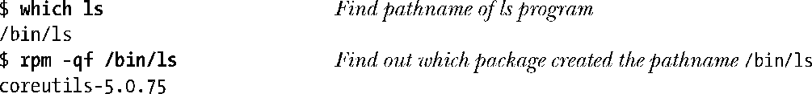

### 附录E　更多信息源

除了本书提供的材料之外，有关 Linux 系统程序设计的信息源还有很多。本附录对其中一些进行了简介。

#### 手册

通过man命令可以访问手册。（命令man man描述了如何使用man来读取手册。）手册被划分成了用数字标记的小节，这些小节将信息分成如下几类。

**1．** 程序和shell命令：由用户在shell提示符中执行的命令。

**2．** 系统调用：Linux系统调用。

**3．** 库函数：标准C库函数（以及很多其他库函数）。

**4．** 特殊文件：特殊文件，如设备文件。

**5．** 文件格式：诸如系统密码（/etc/passwd）和组（/etc/group）文件的格式。

**6．** 游戏：游戏。

**7．** 概述、规则、协议以及其他：各种主题的概述、以及有关网络协议和socket程序设计的各种页面。

**8．** 系统管理命令：主要由超级用户使用的命令。

在一些情况下，不同小结中的手册页面的名字是一样的。如chmod命令位于手册页的第一小节，而chmod()系统调用则位于手册页的第二小节。为区分名字相同的手册页需要在名字后面的括号中加上小节编号——如 chmod(1)和 chmod(2)。要显示具体某一个小节的手册页则可以在man命令中插入小节编号。

系统调用和库函数的手册页被分成了几个部分，通常包括下列几个。

+ 名字：函数的名字，随带一行描述。下面的命令可以用来获取那一行描述中包含指定字符串的所有手册页列表：
+ 
+ 这在无法记住或不知道到底要查找哪个手册页时是有用的。
+ 大纲：函数的C原型，它标识了函数的参数的类型和顺序以及函数的返回类型。在大多数情况下，在函数原型前面会由一个头文件列表。这些头文件定义了函数所使用的宏和C类型以及函数原型本身，使用这个函数的程序应该包含这些头文件。
+ 描述：描述函数的功能。
+ 返回值：对函数返回值的描述，包括函数如何通知调用者发生了一个错误。
+ 错误：发生错误时可能返回的errno值列表。
+ 符合：描述了这个函数符合哪些UNIX标准。这样就能够了解到这个在其他UNIX实现上的移植性如何，同时也标识出了这个函数中特定于Linux的方面。
+ Bug：描述了函数无法正常工作或无法按照预期工作的地方。

> 尽管随后的一些商用UNIX实现倾向于采用更适合市场的较为委婉的说法，但UNIX手册页在早期将一个bug就称为bug。Linux延续了这种传统。有时候这些“bug”是哲学意义上的，它们只是描述了哪些方面有待优化或对有关特殊或非预期的（但在其他场景下可能是预期的）行为发出警告。

+ 注释：其他有关这个函数的注释。
+ 参见：描述相关函数和命令的手册页列表。

描述内核和glibc API的在线手册页位于http://www.kernel.org/doc/man-pages/。

#### GNU info文档

GNU项目没有使用传统的手册页格式，相反，它使用了info文档来记录其大多数软件的文档，info文档是能够使用info命令浏览的一种超链接文档。使用命令info info能够获取如何使用info的入门指南。

尽管在很多情况下手册页中的信息与对应的info文档中的信息是一样的，但有些时候C库的info文档包含了额外的在手册页中无法找到的信息，反之亦然。

> 尽管手册页和info文档包含的信息可能是相同的，但它们仍然同时存在，其原因与其习惯稍微有点关系。GNU项目倾向于使用info用户界面，因此通过info来提供所有的文档。但UNIX系统的用户和程序员使用手册页已经有很长的历史了（并且在很多情况下倾向于使用手册页）。手册页往往也比info文档包含更多历史信息（如有关行为在版本之间的变更的信息）。

#### GNU C库（glibc）手册

GNU C库包含了一个描述如何使用库中的大多数函数的手册。这个手册位于http://www.gnu.org/。同时，在大多数发行版中也提供了HTML格式和info格式（通过命令info libc）的手册。

#### 书籍

本书最后列出了大量参考书籍，其中一些特别值得说一下。

参考书籍列表中的前面几本是由W. Richard Stevens撰写的。“Advanced Programming in the UNIX Environment”([Stevens, 1992])详细描述了 UNIX 系统程序设计，它所关注的是POSIX、System V以及BSD。最新的修订工作是由Stephen Rago完成的，[Stevens & Rago, 2005]更新了对现代标准和实现的描述，并增加了对线程的描述和有关网络程序设计的一个章节。这本书很好地从另外一个视角介绍了本书所涉及的很多种主题。两卷“UNIX Network Programming”（[Stevens et al., 2004], [Stevens, 1999]）极其详细地描述了网络程序设计和UNIX系统上的进程间通信。

> [Stevens et al., 2004]是 Bill Fenner 和 Andrew Rudoff 在上一版的“UNIX Network Programming”第1卷[Stevens, 1998]的基础上修订而来的。尽管这个修订版介绍了几个新领域，但在大多数需要参考[Stevens et al., 2004]的情况下都可以在[Stevens, 1998]找到同样的材料，仅有的差别仅仅是所在的章节不同。

“Advanced UNIX Programming”([Rochkind, 1985])幽默诙谐地对UNIX（System V）程序设计进行了介绍。这本书现在已经进行了更新和扩展并出到第二版了（[Rochkind, 2004]）。

“Programming with POSIX Threads”([Butenhof, 1996])详尽地描述了POSIX线程API。

“Linux and the Unix Philosophy”([Gancarz, 2003])对Linux和UNIX系统上应用程序的设计哲学进行了简介。

介绍如何阅读和修改Linux内和源代码的书籍有很多，包括“Linux Kernel Development”([Love, 2010])和“Understanding the Linux Kernel”([Bovet & Cesati, 2005])。

对于UNIX内核的更一般的背景来讲，“The Design of the UNIX Operating System”([Bach, 1986])仍然是一本非常值得一读的书，其中还包含了与Linux有关的材料。“UNIX Internals: The New Frontiers”([Vahalia, 1996])则对更现代的UNIX实现的内核内幕进行了介绍。

对于编写Linux设备驱动来讲，最根本的参考书籍是“Linux Device Drivers”([Corbet et al., 2005])。

“Operating Systems: Design and Implementation”([Tanenbaum & Woodhull, 2006])使用Minix描述了操作系统实现。（参见http://www.minix3.org/。）

#### 既有应用程序的源代码

阅读既有应用程序的源代码通常能够较好地理解如何使用特定的系统调用和库函数。在使用RPM包管理器的Linux发行版中可以像下面这样找出包含某个特定程序（如ls）的包。

对应的源代码包的名字与上面的类似，但后缀是.src.rpm。在发行版的安装媒介上可以找到这个包或者在发行者的网站上也可以下载到这个包。一旦获取了包之后可以使用 rpm 命令安装，然后就可以研究源代码了，它通常位于/usr/src下的某个目录中。

在使用Debian包管理器的系统上查找源代码的过程是类似的。使用下面的命令可以确定创建了一个路径名的包（本例中是ls程序）。

#### Linux文档项目

Linux 文档项目（http://www.tldp.org/）生产 Linux 上免费可用的文档，包括系统管理和程序设计主题方面的HOWTO指南和FAQ（常见问题及答案）。这个站点还提供了有关各种主题的大量电子书。

#### GNU项目

GNU项目（http://www.gnu.org/）提供了海量的软件源代码及相关文档。

#### 新闻组

Usenet新闻组通常是查找特定的程序设计问题的答案的较佳场所。下面几个新闻组特别有帮助。

+ comp.unix.programmer解决常规的UNIX程序设计问题。
+ comp.os.linux.development.apps解决与Linux上应用程序开发相关的问题。
+ comp.os.linux.development.system是Linux系统开发新闻组，它关注的是修改内核以及开发设备驱动和可加载模块方面的问题。
+ comp.programming.threads讨论与线程、特别是POSIX线程程序设计相关的问题。
+ comp.protocols.tcp-ip讨论TCP/IP联网协议套件。

很多Usenet新闻组的FAQ可以在http://www.faqs.org/处找到。

> 在向新闻组提交问题时先查看一下该组的FAQ（通常在一个组中经常被提及的问题）并尝试在网上搜索出该问题的解决方案。http://groups.google.com/网站为搜索较早发表的Usenet文章提供了一个基于浏览器的界面。

#### Linux内核邮件列表

Linux内核邮件列表（LKML）是Linux内核开发人员主要的广播通信媒介。它提供了内核开发的现状，并且也是一个提交内核bug报告和补丁的论坛。（LKML不是一个提出系统程序设计问题的论坛。）要订阅LKML需要向majordomo@vger.kernel.org发送一封消息正文为下面这行文字的电子邮件。

有关列表服务器的工作方式方面的信息可以通过向同一个地址发送一份消息正文为单词“help”的邮件来完成。

要向LKML发送一条消息需要使用地址linux-kernel@vger.kernel.org。FAQ和指向这个邮件列表的一些可搜索的归档的链接可以在http://www.kernel.org/上找到。

#### 网站

下面的网站值得特别关注。

+ http://www.kernel.org/，The Linux Kernel Archives，包含了过去以及现在的所有版本的Linux内核的源代码。
+ http://www.lwn.net/，Linux Weekly News，提供了有关各种Linux相关的主题方面的每日和每周专栏。每周的内核开发专栏会对LKML中发生的事情进行总结。
+ http://www.kernelnewbies.org/，Linux Kernel Newbies，是那些想要学习和修改Linux内核的程序员的起点。
+ http://lxr.linux.no/linux/，Linux Cross-reference，提供了通过浏览器访问各个版本的Linux内核的源代码的方式。源文件中的每个标识符都是加上超链接的，这样就能够很容易地找出其定义和使用该标识符的地方。

#### 内核源代码

如果前面列出的信息源都无法回答所涉及到的问题或者想要确认文档记录的信息是否正确，那么可以阅读内核源代码。尽管部分源代码可能难以理解，但阅读Linux内核源代码中一个具体的系统调用（或GNU C库源代码中一个具体的库函数）的代码通常是找到一个问题的答案的最快方式。

如果已经将 Linux 内核源代码安装在了系统上，那么通常可以在/usr/src/linux 目录中找到它。表E-1对这个目录中的一些子目录进行了总结。

<b class="my_markdown">表E-1：Linux源代码树中的子目录</b>

| 目　　录 | 内　　容 |
| :-----  | :-----  | :-----  | :-----  |
| Documentation | 内核的各个方面的文档 |
| arch | 特定于架构的代码，组织成了子目录——如alpha、arm、ia64、sparc以及x86 |
| drivers | 设备驱动的代码 |
| fs | 特定于文件系统的代码，组织成了子目录——如btrfs、ext4、proc (/proc 文件系统)以及vfat |
| include | 内核代码所需的头文件 |
| init | 内核的初始化代码 |
| ipc | System V IPC和POSIX消息队列的代码 |
| kernel | 与进程、程序执行、内核模块、信号、时间以及定时器相关的代码 |
| lib | 内核的各个部分用到的常规函数 |
| mm | 内存管理代码 |
| net | 联网代码（TCP/IP、UNIX和Internet domain socket） |
| scripts | 配置和构建内核的脚本 |

