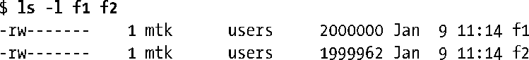
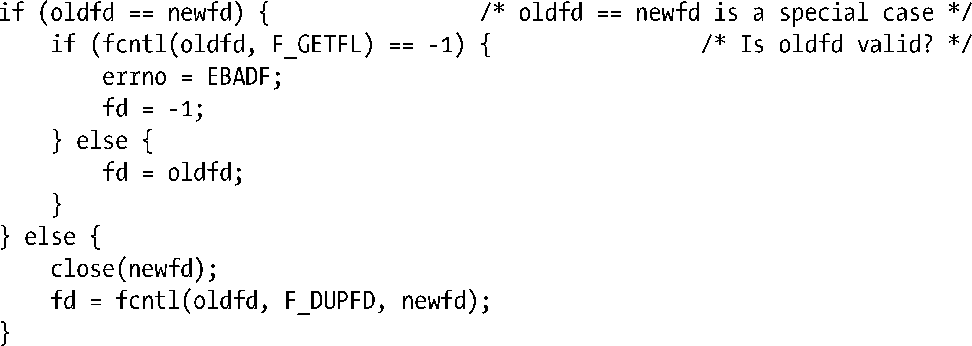
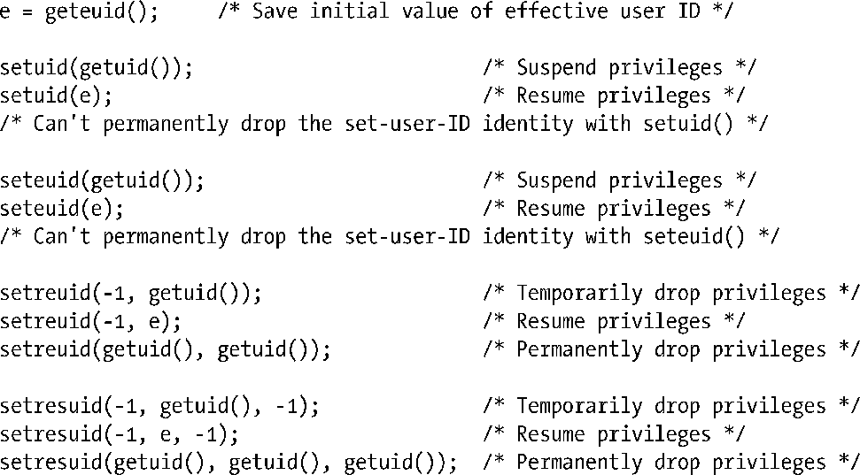
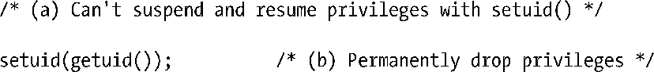
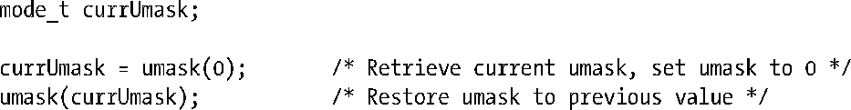
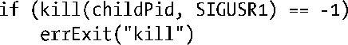
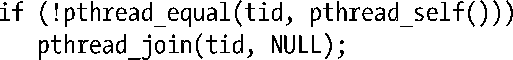

### 附录F　部分习题解答

##### 第5章

**5-3.** 　随本书一同发布的源代码fileio/atomic_append.c文件提供了一种答案，此处是程序运行结果的例子之一：

因为lseek()和write()的组合操作不具有原子性，所以程序的一个实例有时会覆盖另一实例写入的字节。最终，f2所包括的字节数少于2MB。

**5-4.** 　可以将对dup()的调用改写为：

对dup2()的调用可以改写为：

**5-6.** 　首先要意识到这一点：由于fd2是对fd1的复制，它们都共享了一个打开文件描述，因此也共享了同一文件偏移量。然而，因为fd3是通过单独的open()调用而创建的，所以它具有单独的文件偏移量。

+ 第一次write()调用后，文件内容为Hello,。
+ 由于fd2与fd1共享一个文件偏移量，所以第二次write()调用会追加到已有文本的后面，生成Hello, world。
+ lseek()调用将fd1和fd2共享的文件偏移量调整到文件起点，因此第三次write()调用覆盖了部分已有文本，产生了HELLO, world。
+ fd3的文件偏移量到目前为止一直未变，指向文件的起点。因此，最后一次write()调用将文件内容改为Gidday world。
+ 运行随本书发布源码中的fileio/multi_descriptors.c程序，并观察输出结果。

##### 第6章

**6-1.** 　因为未对数组mbuf进行初始化，所以它属于未初始化数据段。因此，存放该变量无需磁盘空间。相反，会在加载程序时为其分配存储空间（并初始化为0）。

**6-2.** 　随本书发布的源文件proc/bad_longjmp.c提供了使用longjmp()不当的范例之一。

**6-3.** 　随本书发布的源文件proc/ setenv.c 提供了setenv()和unsetenv()的实现范例。

##### 第8章

**8-1.** 　二次对getpwuid ()的调用在printf()函数的输出字符串构建之前——因为getpwuid ()调用返回的pw_name存放于静态分配的缓冲区中——第二次调用将覆盖第一次调用返回的结果。

##### 第9章

**9-1.** 　思考以下情况的同时，请记住，对有效用户ID的修改总是会修改文件系统用户ID。

**9-2.** 　严格说来，进程的有效用户ID为非0值，进程就属于一个无特权进程。然而，无特权进程可以使用setuid()、setreuid()、 seteuid()或者setresuid()调用将进程有效用户ID设置为与其实际用户ID或保存set-user-ID相同。因此，该进程能够使用此类调用之一来重新获得特权。

**9-4.** 　以下代码显示了每个系统调用的步骤。

**9-5.** 　除去setuid()的异常情况之外，答案与前一练习相同，除了要将变量e替换成0。对于setuid()，以下操作是成立的。

##### 第10章

**10-1.** 　最大的32位无符号整型值是4294967295。将该数除以每秒100次滴答声，则相当于497天多一点。将该数除以100万(CLOCKS_PER_SEC)，则相当于71分35秒。

##### 第12章

**12-1.** 　随本书一同发布的源文件sysinfo/procfs_user_exe.c提供了一种解决方案。

##### 第13章

**13-3.** 　语句的顺序确保了将写入stdio缓冲区的数据刷新到磁盘上。fflush()调用将fp指向的stdio缓冲区内容刷新到内核缓冲区高速缓存中。随后赋给fsync()调用的参数是fp底层的文件描述符。因此，调用将此文件描述符所指向的（刚填充的）内核缓冲区刷新到了磁盘。

**13-4.** 　当标准输出发往终端时，属于行缓冲，所以printf()调用的输出立刻显示，并尾随write()调用的输出。当标准输出发送到磁盘文件时，则属于块缓冲。因此，printf()的输出将存放在stdio缓冲区中，仅当程序退出时才进行刷新（即在write() 函数调用后）（包含练习代码的完整程序可参考与本书一同发布的源文件filebuff/mix23_linebuff.c）。

##### 第15章

**15-2.** 　stat()系统调用不会改变任何文件时间戳，因为其所作所为仅仅是从文件i-node中获取信息（并且并没有最后i-node访问时间戳的概念）。

**15-4.** 　GNU C 函数库提供了以euidaccess()命名的一个函数，请参考函数库源文件sysdeps/ posix/euidaccess.c。

**15-5** .　为了实现这一点，必须二次调用umask()，如下所示。

但是请注意，由于线程共享了进程的umask设置，所以该方案不是线程安全的。

**15-7.** 　随本书一同发布的源文件files/chiflag.c提供了一种解决方案。

##### 第18章

**18-1.** 　使用ls –li命令可以看到：可执行文件在每次编译后都具有不同的i-node编号。这是因为编译器移除了（解除链接）任何与目标可执行文件同名的文件，然后再创建一个同名的新文件。解除对可执行文件的链接是允许的。虽然其名称被即刻移除了，但是文件本身仍然会保持存在，直至执行它的进程终止。

**18-2.** 　myfile文件创建于子目录test中。symlink()调用在父目录中创建了一个相对链接。尽管有链接文件，但是因为对链接的解释是相对于链接文件的位置而言的，所以这是一个悬空链接。因此，链接指向父目录中一个不存在的文件。结果，chmod()调用失败，错误号为ENOENT（“没有这样的文件或者目录”）。（包含练习代码的完整程序可参考与本书一同发布的源文件dirs_links/bad_symlink.c。）

**18-4.** 　随本书一同发布的源文件dirs_links/list_files_readdir_r.c提供了一种解决方案。

**18-7.** 　随本书一同发布的源文件dirs_links/file_type_stats.c提供了一种解决方案

**18-9.** 　使用fchdir()调用更为高效。如果在循环中反复执行操作，那么当调用fchdir()时，可以在运行循环前调用一次open()；而当调用chdir()时，可以将getcwd()调用置于循环之外。随后可以比较重复调用fchdir(fd) 和 chdir(buf)之间的差异。调用chdir()之所以代价高昂，有两点原因：传递buf参数到内核需要在用户空间和内核空间之间进行大数据量传输，每次调用时必须将buf中的路径名解析到相应目录的i-node上。（内核对目录条目信息的高速缓存减少了第二个原因的开销，但总有些工作是省不了的。）

##### 第20章

**20-2.** 　随本书一同发布的源文件signals/ignore_pending_sig.c提供了一种解决方案。

**20-4.** 　随本书一同发布的源文件signals/siginterrupt.c提供了一种解决方案。

##### 第22章

**22-2.** 　与大多数UNIX实现一样，Linux在实时信号之前传递标准信号（SUSv3并不要求如此）。这是合理的，因为有些标准信号所指示的临界状态（例如，硬件异常）需要程序尽快处理。

**22-3.** 　将sigsuspend()外加信号处理器的方法用sigwaitinfo()替换，这将带来25%到40%的速度提升。（确切数据随内核版本不同而略有不同。）

##### 第23章

**23-2.** 　随本书一同发布的源文件 timers/t_clock_nanosleep.c 提供了一种使用了 clock_nanosleep()的改进程序。

**23-3.** 　随本书一同发布的源文件timers/ptmr_null_evp.c提供了一种解决方案。

##### 第24章

**24-1.** 　首次fork()调用创建了一个新的子进程。然后父、子进程继续执行第二个fork()调用，这样每个进程又创建了一个子进程，总共有4个进程。所有这4个进程继续执行下一个fork()调用，每个进程又分别创建了一个子进程，最终，一共创建了7个新进程。

**24-2.** 　随本书一同发布的源文件procexec/vfork_fd_test.c提供了一种解决方案。

**24-3.** 　如果调用fork()，然后令其子进程调用raise()，向自己发送诸如SIGABRT之类的信号，那么将产生一个核心转储文件，该文件将密切反映fork()调用时父进程的状态。gdb gcore命令为程序执行类似任务，且不需要修改源码。

**24-5.** 　在父进程中添加一个逆向的kill()调用。

在子进程中添加一个逆向的sigsuspend()调用。

##### 第25章

**25-1.** 　假设采用了二进制补码结构，将所有比特位置 1 来表示−1，父进程将得到退出码255。（最低八个有效比特位全为1，这就是当父进程调用wait()时返回给它的结果）。（在程序中调用exit（−1）是一种程序员常犯的错误，主要是因为将程序的返回码−1与通常用于表明系统调用失败的返回码−1混淆了起来。）

##### 第26章

**26-1.** 　随本书一同发布的源文件procexec/orphan.c提供了一种解决方案。

##### 第27章

**27-1.** 　execvp()函数首先不能执行dir1目录中的文件xyz，因为该目录的执行权限遭禁。

因此会继续搜索目录dir2，并成功执行文件xyz。

**27-2.** 　随本书一同发布的源文件procexec/execlp.c提供了一种解决方案。

**27-3.** 　脚本指定cat程序作为其解释器。cat程序对文件的“解释”就是打印文件内容，在启用-n（行编号）选项的情况下（就像输入命令cat –n ourscript一样）。因此将看到如下输出。

**27-4.** 　连续两次fork()将产生三个进程，形成父进程、子进程和孙进程的关系。创建孙进程后，子进程将立即退出，然后由父进程的waitpid()调用获得。因为成为孤儿进程，所以孙进程为init进程(进程ID为1)所收养。程序不需要执行第二次wait()调用，因为当孙进程终止时，init进程自动完成僵尸进程的收集工作。使用这一代码序列可能存在这种用途：如果需要创建子进程，而稍后又无法等待它，那么使用这一代码序列可以保证不会产生僵尸进程。此类需求的例子之一是：父进程执行了一些程序，又无法保证对其执行wait (而且也不想将SIGCHLD的信号处置置为SIG_IGN，因为对于exec()之后遭忽视的SIGCHLD的信号处置，SUSv3并未规范。)

**27-5.** 　传递给printf()调用的字符串没有包括一个换行符，因此，在调用execlp()之前也不会刷新输出。execlp()调用会覆盖程序已存在的数据段（还有堆和栈），其中就包括stdio缓冲区，因此未刷新的输出就会丢失。

**27-6.** 　传递SIGCHLD信号给父进程。如果SIGCHLD处理器函数试图调用wait()，那么调用将返回错误（错误号为ECHILD），表示没有可返回状态的子进程。（这里假设父进程没有其他遭到终止的子进程。如果有，那么wait()调用将阻塞，或者如果使用了WNOHANG 标志来调用waitpid()，那么waitpid()将返回0）如果程序在调用system()之前为SIGCHLD信号建立了一个处理器函数，那么这种情况就完全有可能出现。

##### 第29章

**29-1.** 　可能会有两种结果（都获得了SUSv3的支持）：线程死锁，当试图加入自己时遭到阻塞，或者调用pthread_join()失败，返回错误为EDEADLK。在Linux中，会发生后一种行为。在tid中给定一个线程 ID，可使用如下代码来阻止这种不测事件。

**29-2.** 　主线程终止后，threadFunc()函数继续对主线程堆栈中的数据进行操作，结果难以预测。

##### 第31章

**31-1.** 　随本书一同发布的源文件threads/one_time_init.c提供了一种解决方案。

##### 第33章

**33-2.** 　SIGCHLD 信号是面向进程的，产生于子进程终止时。可以将其传递给未阻塞该信号的任何线程（不必非要是发起fork()调用的那条线程）。

##### 第34章

**34-1.** 　假设程序是一个shell管道的一部分。

这里存在的问题是grep与ourprog同属一个进程组，因此killpg()调用也会终止grep进程。这种行为可能并不是期望的行为，并且可能会误导用户。这个问题的解决方案是使用setpgid()确保子进程会被放置在自己的新组中（第一个子进程的进程ID可以用作组的进程组ID），然后向该进程组发送信号。这样就没有必要让父进程不响应这个信号了。

**34-5.** 　如果在再次产生SIGTSTP信号之前该信号被解除了阻塞，那么就存在一小段时间窗口（在sigprocmask()调用和raise()之间），在这段期间内如果用户输入了第二个挂起字符（Control-Z），那么就会出现进程还处于处理器中时被停止的情况，其结果是需要使用两个SIGCONT信号才能够恢复该进程。

##### 第35章

**35-3.** 　在本书随带的源代码的procpri/demo_sched_fifo.c文件中提供了一个解决方案。

##### 第36章

**36-1.** 　在本书随带的源代码的procres/rusage_wait.c文件中提供了一个解决方案。

**36-2.** 　在本书随带的源代码的procres子目录下的rusage.c和print_rusage.c文件中提供了一个解决方案。

##### 第37章

**37-1.** 　在本书随带的源代码的daemons/t_syslog.c文件中提供了一个解决方案。

##### 第38章

**38-1.** 　当一个文件被一个非特权用户修改之后，内核会清除文件上的set-user-ID权限位。类似地，如果启用了组执行权限的话也会清除set-group-ID权限位。（正如55.4节中所细述的那样，在启用set-group-ID位的同时禁用组执行位对set-group-ID程序没有任何影响；相反，它用于启用强制式加锁，并且正因为这个原因，对此类文件的修改不会禁用set-group-ID位。）清除这些位能够保证计算程序文件可被任意用户写入也无法修改这个文件，并且仍然保留其向执行这个文件的用户赋予特权的能力。特权（CAP_FSETID）进程能够修改一个文件而无需内核清除这些权限位。

##### 第44章

**44-1.** 　在本书随带的源代码的pipes/change_case.c文件中提供了一个解决方案。

**44-5.** 　它创建了一个竞争条件。假设在服务器看到文件结束的时刻与它关闭文件读取描述符时刻之间，一个客户端打开了这个FIFO以便写入（这将会立即成功而不会发生阻塞），然后在服务器关闭了读取描述符之后向该FIFO写入数据。此刻，客户端会收到一个SIGPIPE信号，因为没有进程打开该FIFO 来读取数据。或者客户端在服务器关闭读取描述符之前可能能够打开这个 FIFO 并向其写入数据。在这种情况下，客户端的数据可能会丢失，并且它不会接收到来自服务器的响应。作为一个深入练习，读者可以尝试模拟这种行为，即按照建议修改服务器并创建一个特殊的客户端，该客户端重复不断地打开服务器的FIFO，向服务器发送一条消息，关闭服务器的FIFO，以及读取服务器的响应（如果存在的话）。

**44-6.** 　一个可能的解决方案像23.3节中描述的那样使用alarm()为客户端的FIFO上的open()调用设置一个定时器。这个解决方案的一个缺点是服务器仍然会延迟超时时间间隔。另一个可能的解决方案是使用 O_NONBLOCK 标记打开客户端FIFO。如果这个操作失败了，那么服务器可以认为客户端的行为异常。后一种解决方案还需要修改客户端使其确保在向服务器发送请求之前打开自己的FIFO（也使用O_NONBLOCK标记）。为方便起见，客户端接着应该关闭FIFO文件描述符的O_NONBLOCK标记，这样后续的read()调用就会阻塞。最后，也可以为这个应用程序采用并发服务器解决方案，其中主服务器进程创建子进程来向各个客户端发送响应消息。（对于这个简单的应用程序来讲，这种解决方案所消耗的资源是比较大的。）

服务器没有处理的情况仍然存在。如它并没有处理序号溢出或行为不轨的客户端请求大量序号以制造溢出的情况。这个服务器也没有处理客户端请求负的序号长度的情况。此外，恶意的客户端可以创建自己的回复FIFO，然后打开这个FIFP来读取和写入，并在向服务器发送请求之前填充数据，但当其尝试写入回复时就会发生阻塞。作为一个深入练习，读者可以尝试设计一些策略来处理这些情况。

在44.8节中还指出了程序清单44-7中给出的服务器存在的另一个限制：如果一个客户端发送了一条包含错误的字节数的消息，那么服务器在读取所有后续的客户端消息时就会发生错乱。解决这个问题的一个简单方法是不使用固定长度的消息，转而使用分隔字符。

##### 第45章

**45-2.** 　在本书随带的源代码的svipc/t_ftok.c文件中提供了一个解决方案。

##### 第46章

**46-3.** 　值0是一个有效的消息队列标识符，但0无法用作消息类型。

##### 第47章

**47-5.** 　在本书随带的源代码的svsem/event_flags.c文件中提供了一个解决方案。

**47-6.** 　一个预留操作可以实现成从FIFO中读取一个字节。与之相反的是，一个释放操作可以实现成向这个FIFO写入一个字节。一个条件预留操作可以实现成从FIFO中非阻塞地读取一个字节。

##### 第48章

**48-2.** 　因为在for循环中递增步骤中对shmp–>cnt值的访问没有受到信号量的保护，因此在写者下一次更新这个值与读者获取这个值之间存在一个竞争条件。

**48-4.** 　在本书随带的源代码的svshm/svshm_mon.c文件中提供了一个解决方案。

##### 第49章

**49-1.** 　在本书随带的源代码的mmap/mmcopy.c文件中提供了一个解决方案。

##### 第50章

**50-2.** 　在本书随带的源代码的vmem/madvise_dontneed.c文件中提供了一个解决方案。

##### 第52章

**52-6.** 　在本书随带的源代码的 pmsg/mq_notify_sigwaitinfo.c 文件中提供了一个解决方案。

**52-7.** 　将buffer变成全局是不安全的。一旦在threadFunc()中重新启用了消息通知，那么就可能出现在threadFunc()执行期间产生第二个通知的情况。这第二个通知会启动第二个线程来执行 threadFunc()，与此同时第一个线程也在执行 thread Func()。这两个线程会使用同一个全局的buffer，从而导致不可预知的结果。注意这种行为是依赖于实现的。SUSv3 允许一个实现顺序地向同一个进程分发通知，但它也允许向并发执行的不同线程分发通知，Linux就是这样做的。

##### 第53章

**53-2.** 　在本书随带的源代码的psem/psem_timedwait.c文件中提供了一个解决方案。

##### 第55章

**55-1.** 　Linux上的flock()具有下列特点。

a）一系列共享锁可以使等待放置一把互斥锁的进程饿死。

b）没有规则确定哪个进程会得到锁。本质上来讲，锁会被分配给下一个被调度的进程。如果该进程恰好获取了一把共享锁，那么所有其他请求共享锁的进程的请求也将同时得到满足。

**55-2.** 　flock()系统调用没回检测死锁。这一点适用于大多数flock()实现，但使用fcntl()实现flock()的除外。

**55-4.** 　在除早期（1.2以及以前）之外的Linux内核中存在两种独立运行的加锁机制，并且两个互不影响。

##### 第57章

**57-4.** 　在Linux上，sendto()调用会失败并返回EPERM错误。在其他一些UNIX系统上会产生一个不同的错误。一些UNIX实现并不要求这一限制，而是会让一个已连接的UNIX domain数据报socket从其发送者处接收一个数据报，而不是从其对等处接收一个数据报。

##### 第59章

**59-1.** 　在本书随带的源代码的 sockets 子目录的read_line_buf.h和read_line_buf.c文件中提供了一个解决方案。

**59-2.** 　在本书随带的源代码的sockets子目录的 is_seqnum_v2_sv.c、is_seqnum_v2_cl.c以及is_seqnum_v2.h文件中提供了一个解决方案。

**59-3.** 　在本书随带的源代码的 sockets 子目录的unix_sockets.h、unix_sockets.cus_xfr_v2.h、us_xfr_v2_sv.c以及us_xfr_v2_cl.c文件中提供了一个解决方案。

**59-5.** 　在Internet domain中，来自非对等socket的数据报会被静默地丢弃。

##### 第60章

**60-2.** 　在本书随带的源代码的sockets/is_echo_v2_sv.c文件中提供了一个解决方案。

##### 第61章

**61-1.** 　由于一个TCP socket的发送和接收缓冲器的大小都是有限的，因此如果客户端发送了大量的数据，那么它可能会填满这些缓冲器，此时后续的write()就会（永久地）阻塞客户端直到它读取了服务器的响应为止。

**61-3.** 　在本书随带的源代码的sockets/sendfile.c文件中提供了一个解决方案。

##### 第62章

**62-1.** 　当在不引用终端的文件描述符上应用tcgetattr()时会失败。

**62-2.** 　在本书随带的源代码的tty/ttyname.c文件中提供了一个解决方案。

##### 第63章

**63-3.** 　在本书随带的源代码的altio/select_mq.c文件中提供了一个解决方案。

**63-4.** 　会产生一个竞争条件。假设按序发生了下列事件：（a）在select()通知程序自己的管道中有数据之后，它执行了合适的动作来响应这个信号；（b）另一个信号到达了，并且该信号处理器向自己的管道中写入了一个字节并返回；（c）主程序读取了管道中的全部数据。其结果是程序会错过在步骤（b）中发出的信号。

**63-6.** 　epoll_wait()调用会阻塞，即使当所关注的列表为空时。这在多线程程序中是比较有用的，其中一个线程可能会向epoll所关注的列表中添加一个描述符，而另一个线程则阻塞在一个epoll_wait()调用中。

**63-7.** 　后续的epoll_wait()调用会遍历列表中已就绪的文件描述符。这种做法是有好处的，它避免出现文件描述符饿死的情况，因为当epoll_wait()总是（假设）返回数值最小的就绪文件描述符并且该文件描述符总是有一些可用输入的话就可能会发生这种情况。

##### 第64章

**64-1.** 　首先，子shell进程终止，然后是script父进程终止。由于终端是运行于raw模式下的，因此终端驱动器不会对Control-D字符进行解释，它会将其作为一个字面字符传递给 script 父进程，而该进程会将该字符写入到伪终端主设备中。伪终端从设备运行于canonical模式下，因此这个 Control-D 字符会被当成文件结束处理，这将会导致子shell进程的下一个read()调用返回0，从而导致shell终止。shell的终止会关闭唯一一个引用着伪终端从设备的文件描述符，其结果是父 script 进程的下一个read()调用会返回EIO错误（在其他一些UNIX实现上可能是文件结束），然后这个进程会终止。

**64-7.** 　在本书随带的源代码的pty/unbuffer.c文件中提供了一个解决方案。

