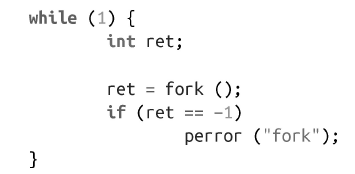
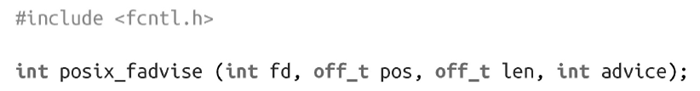

### 本书使用的体例

本书遵循以下字体体例：

斜体（Italic）

表示新的术语、URL、E-mail地址、文件名和文件扩展名。

等宽字体（Constant width）

用于程序清单以及段落中的程序单元，如变量或函数名称、数据库、数据类型、环境变量、声明和关键字。

等宽粗体字（ **Constant width bold** ）

显示命令或者其他由用户输入的文本。

等宽斜体字（Constant width italic）

表示必须根据用户提供的值或者由上下文决定的值进行替代的文本。

>  该图标表示提示、建议或普通注意事项。

> 该图标表示告警或警告。

本书中的大部分代码片段形式简单、可重用。它们看起来如下：

为了使代码片段既看起来简洁，又是可用的，我们做了很大努力。不要特殊的头文件、各种宏定义以及不可识别的简写。我们并没有构建非常巨型的程序，而是给出很多简单的示例。由于示例必须易于描述、可用，并且简单清晰，我希望这些示例可以作为第一次阅读本书的有用教程，而在后续阅读过程中，依然可以作为参考手册。

本书中几乎所有的示例都是自包含的。这意味你可以把这些示例代码复制到自己的文本编辑器中，并利用这些代码片段。除非特别提出，所有代码片段都应该不需要任何特殊的编译器标志位就可以编译通过（在极少数情况下，需要链接到某个特定的库）。我建议通过以下命令来编译一个源文件：

通过以上命令，会把源文件snippet.c编译成可执行的二进制文件snippet，支持很多告警检查、重要明智的优化以及调试。本书提供的代码通过这种编译方式应该可以编译通过，而不会生成错误和告警信息——虽然你可能需要首先把代码补充完整。

当一节介绍新的函数时，该函数是以UNIX的man页面格式给出，看起来如下：

需要包含的头文件，以及所有定义，都是在最上方，然后是该调用的完整形式。

