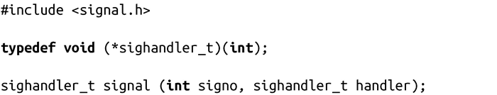

### 10.2　基本信号管理

最简单古老的信号管理接口是signal()函数。该函数由ISO C89标准定义，其中只定义了信号支持的最少的共同特征，该系统调用是非常基本的。Linux通过其他接口提供了更多的信号控制，我们将在本章稍后介绍。因为signal()是最基本的，也由于它是在ISO C中定义的，因此它的使用相当普遍，我们先来讨论它：

signal()调用成功时，会移除接收signo信号的当前操作，并以handler指定的新信号处理程序代替它。signo是前面讨论过的信号名称的一种，例如SIGINT或SIGUSR1。回想一下，进程不能捕获SIGKILL和SIGSTOP，因此给这两个信号设置处理程序是没有意义的。

信号处理函数必须返回void，这是有道理的，因为（不像正常的函数）在程序中没有地方给这个函数返回。该函数需要一个整数参数，这是被处理信号的标识符（例如SIGUSR2）。这使得一个信号处理函数可以处理多个信号。函数原型如下：

Linux用typedef将该函数原型定义为sighandler_t。其他的UNIX系统直接使用函数指针，一些系统则有它们自己的类型，可能不会以sighandler_t命名。追求可移植性的程序不要直接使用该类型。

当内核给已经注册过信号处理程序的进程发送信号时，内核会停止程序的正常指令流，并调用信号处理程序。信号的值被传递给信号处理程序，该值就是signo最初提供给signal()的值。

也可以用signal()指示内核对当前的进程忽略某个指定信号，或重新设置该信号的默认操作。这可以通过使用特殊参数值来实现：

SIG_DFL

将signo所表示的信号设置为默认操作。例如对于SIGPIPE，进程将会终止。

SIG_IGN

忽略signo表示的信号。

signal()函数返回该信号先前的操作，这是一个指向信号处理程序SIG_DFL或SIG_IGN的指针。出错时，函数返回SIG_ERR，并不设置errno值。

