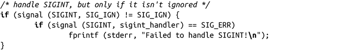
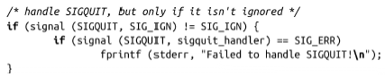

### 10.2.3　执行和继承

调用fork创建子进程时，子进程会继承父进程的所有信号处理。也就是说，子进程会从父进程拷贝为每个信号注册的操作（忽略、默认、处理）。子进程不会继承父进程挂起的信号，这是合理的，挂起的信号是要发送给某个特定的pid，而不是子进程。

当进程是通过exec系统调用创建的，所有的信号都会设置为默认的操作，除非父进程忽略了它们。在这种情况下，新的进程镜像还会忽略这些信号。换句话说，在exec之前捕获到的任何信号在exec操作后会重新设置为默认操作，所有其他信号还是和原来一样。这种处理方式很有意义，因为新执行的进程不会共享父进程的地址空间，因此不存在任何注册的信号处理函数。新创建的进程会继承挂起的信号。表10-2说明了其继承关系。

<b class="my_markdown">表10-2　继承的信号行为</b>

| 信号行为 | 通过fork创建 | 通过exec创建 |
| :-----  | :-----  | :-----  | :-----  | :-----  |
| 忽略 | 继承 | 继承 |
| 默认 | 继承 | 继承 |
| 处理 | 继承 | 不继承 |
| 挂起信号 | 不继承 | 继承 |

这种进程执行行为有个很重要的用处：当shell“在后台”执行一个进程时（或者另一个后台进程执行了另一个进程），新执行的进程应该忽略中断和退出符。因此，在shell执行后台进程之前，应该把SIGINT和SIGQUIT设置为SIG_IGN。因此，常见的做法是处理这些信号的程序先做检查，确保没有忽略了要使用的信号。举个例子：

设置信号行为前需要检查信号的行为，这是signal()接口一个明显缺点。稍后，我们会讨论另一个函数，它不存在这个问题。

