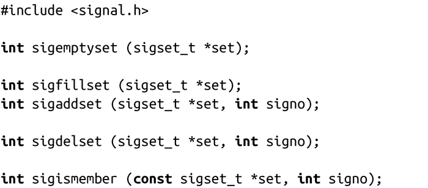

### 10.5　信号集

在本章稍后提到的一些函数需要操作信号集，例如被一个进程阻塞的信号的集合，或者待处理的信号集合。以下列出的信号集操作可以管理这些信号集：

sigemptyset()会初始化由set指定的信号集，将集合标记为空（所有的信号都被排除在集合外）。sigfillset()会初始化由set指定的信号集，将它标记为满（所有的信号都包含在集合内）。两个函数都返回0。你应该在使用信号集之前调用其中一个函数。

sigaddset()将signo加入到set给定的信号集中，sigdelset()将signo从set给定的信号集中删除。成功时两者都返回0，出错时都返回-1，在这种情况下，errno值被设置成EINVAL，意味着signo是一个无效的信号标识符。

如果signo在由set指定的信号集中，sigismember()会返回1，如果不在则返回0，出错时返回-1。在后一种情况下，errno会被设置为EINVA，表示signo无效。

