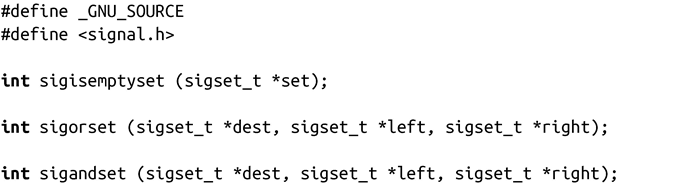
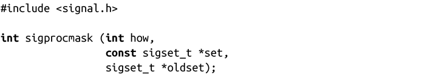

### 10.5.1　更多的信号集函数

上述的函数都是由POSIX标准定义的，可以在任何现代UNIX系统中找到。Linux也提供了一些非标准函数：

如果由set指定的信号集为空，sigisemptyset()会返回1，否则返回0。

sigorset()将信号集left和right的并集（二进制或）赋给dest。sigandset()将信号集left和right的交集（二进制与）赋给dest。成功时两者都返回0，出错时返回-1，并将errno设置为EINVAL。

这些函数很有用，但是希望完全符合POSIX标准的程序应该避免使用它们。

#### 阻塞信号

前面我们讨论了重入和由信号处理程序异步运行引发的问题。我们讨论了不能在信号处理程序内部调用的函数，因为这些函数本身是不可重入的。

但是，如果程序需要在信号处理程序和程序其他部分共享数据时，该怎么办？如果程序中的某些部分在运行期间不希望被中断（包括来自信号处理程序的中断）时，该怎么办？我们把程序中的这些部分称为临界区，我们通过临时挂起信号来保护它们。我们称这些信号被阻塞。任何被挂起的信号都不会被处理，直到它们被解除阻塞。进程可以阻塞任意多个信号，被进程阻塞的信号叫作该进程的信号掩码。

按照POSIX定义，Linux实现了一个管理进程信号掩码的函数：

sigprocmask()的行为取决于how的值，它可以是以下标识值之一：

SIG_SETMASK

调用进程的信号掩码变成set。

SIG_BLOCK

set中的信号被加入到调用进程的信号掩码中。也就是说，信号掩码变成了当前信号掩码和set的并集（二进制或）。

SIG_UNBLOCK

set中的信号被从调用进程的信号掩码中移除。也就是说，信号掩码变成了当前信号掩码和set补集（二进制非）的交集（二进制与）。解除阻塞一个未阻塞的信号是非法的。

如果oldset是非空的，该函数将oldset设置为先前的信号集。

如果set是空的，该函数会忽略参数how，并且不会改变信号掩码，但是仍然会设置oldset的信号掩码。换句话说，给set一个空值是检测当前信号掩码的一种方法。

成功时，调用会返回0。失败时，返回-1，并把errno值设置为EINVAL，表示how是无效的，如果设置为EFAULT，表示set或oldset是无效指针。

不允许阻塞SIGKILL信号或SIGSTOP信号。sigprocmask()会忽略任何将这两个信号加入信号掩码的操作，而不会提示任何信息。

