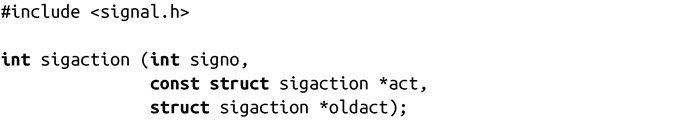
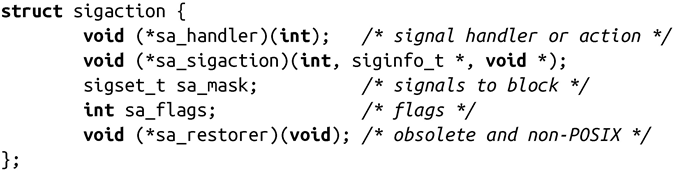

### 10.6　高级信号管理

我们在本章开头学习的signal()函数是非常基础的。它是C标准库的一部分，因此必须对它运行的操作系统能力做最小的假设，它只提供了最低限度的信号管理的标准。作为另一种选择，POSIX定义了sigaction()系统调用，它提供了更加强大的信号管理能力。除此之外，当信号处理程序运行时，可以用它来阻塞特定信号的接收，也可以用它来获取信号发送时各种操作系统和进程状态的信息：

调用sigaction()会改变由signo表示的信号的行为，signo可以是除了与SIGKILL和SIGSTOP关联外的任何值。如果act是非空的，该系统调用将该信号的当前行为替换成由参数act指定的行为。如果oldact是非空的，该调用会存储先前（或者是当前的，如果act是非空的）指定的信号行为。

结构体sigaction支持细粒度控制信号。头文件<sys/signal.h>包含在<signal.h>，以如下形式定义该结构体：

sa_handler变量规定了接收信号时采取的操作。对于signal()来说，该变量可能是SIG_DFL，表示默认操作，也可能是SIG_IGN，表示内核忽略该信号，或者是一个指向信号处理函数的指针。该函数和signal()安装的信号处理程序具有相同的原型：

如果sa_flags被置成SA_SIGINFO，那么将由参数sa_sigaction，而不是sa_handle，来表示如何执行信号处理函数。my_handler()函数的原型略有不同：

该函数会接收信号编号作为其第一个参数，结构体siginfo_t作为第二个参数，结构ucontext_t（强转成void指针）作为第三个参数。函数没有返回值。结构体siginfo_t给信号处理程序提供了丰富的信息，我们很快就会看到它。

需要注意的是，在一些机器体系结构中（可能是其他的UNIX系统），sa_handler和sa_sigaction是在一个联合体中，因此不能给这两个变量同时赋值。

sa_mask变量提供了应该在执行信号处理程序时被阻塞的信号集。这使得编程人员可以为多个信号处理程序的重入提供适当的保护。当前正在处理的信号也是被阻塞的，除非将sa_flags设置成了SA_NODEFER标志。不允许阻塞SIGKILL或SIGSTIO，该调用会在sa_mask中忽略它们，而不会给出任何提示信息。

sa_flag变量是0、1或更多标志位，改变signo所表示的信号处理方式。我们已经看过了SA_SIGINFO和SA_NODEFER标志，sa_flags可以设置的其他值如下：

SA_NOCLDSTOP

如果signo是SIGCHLD，该标志指示系统在子进程停止或继续执行时不要提供通知。

SA_NOCLDWAIT

如果signo是SIGCHLD，该标志可以自动获取子进程：子进程结束时不会变成僵尸进程，父进程不需要（并且也不能）为子进程调用wait()。见第5章对子进程、僵尸进程和wait()的讨论。

SA_NOMASK

该标志已过时且不符合POSIX标准，该标志与SA_NODEFER等价（此部分前面讨论过）。使用SA_NODEFER代替该标志，但是在一些旧的代码中还能见到该标志。

SA_ONESHOT

该标志已过时且不符合POSIX标准，该标志与SA_RESETHAND等价（在下文会讨论）。使用SA_RESETHAND代替该标志，但是在一些旧的代码中还能见到该标志。

SA_ONSTACK

该标志指示系统在一个替代的信号栈中调用给定的信号处理程序，该信号栈是由sigaltstack()提供的。如果你没提供一个替代的栈，系统会使用默认的栈，也就是说，系统的行为和未提供该标志一样。替代的信号栈是很罕见的，虽然它们在一些较小线程栈的pthreads应用程序中是有用的，这些线程栈在被一些信号处理程序使用时可能会溢出。在本书中我们不再进一步讨论sigaltstack()。

SA_RESTART

该标志可以使被信号中断的系统调用以BSD风格重新启动。

SA_RESETHAND

该标志表示“一次性”模式。一旦信号处理程序返回，给定信号就会被重设为默认操作。

sa_restorer变量已经废弃了，并且不再在Linux中使用。它不是POSIX的一部分。应该当作不存在该变量，不要用它。

成功时，sigaction()会返回0。失败时，该调用会返回-1，并将errno设置为以下错误代码之一：

EFAULT

act或oldact是无效指针。

EINVAL

signo是无效的信号、SIGKILL或SIGSTOP。

