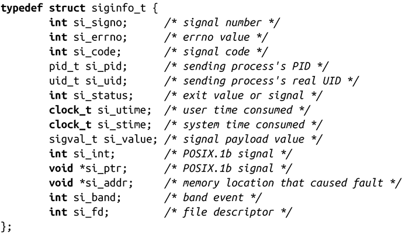

### 10.6.1　结构体siginfo_t

siginfo_t结构体也是在<sys/signal.h>中定义的，如下：

这种结构中都是传递给信号处理程序的信息（如果你使用sa_sigaction代替sa_sighandler）。在现代计算技术中，许多人认为UNIX信号模型是一种非常糟糕的实现IPC（进程间通信）的方法。这很有可能是因为当他们应该使用sigaction()和SA_SIGINFO时，这些人仍然坚持使用signal()。siginfo_t结构为我们打开了方便之门，在信号之上又衍生了大量的功能。

在这个结构体中，有许多有趣的数据，包括发送信号进程的信息，以及信号产生的原因。以下是对每个字段的详细描述：

si_signo

指定信号的编号。在你的信号处理程序中，第一个参数也提供了该信息（避免使用一个复引用的指针）。

si_errno

如果是非零值，表示与该信号有关的错误代码。该域对所有的信号都有效。

si_code

解释进程为什么收到信号以及信号由哪（例如，来自kill()）发出。我们会在下一部分浏览一下可能的值。该域对所有的信号都有效。

si_pid

对于SIGCHLD，表示终止进程的PID。

si_uid

对于SIGCHLD，表示终止进程自己的UID。

si_status

对于SIGCHLD，表示终止进程的退出状态。

si_utime

对于SIGCHLD，表示终止进程消耗的用户时间。

si_stime

对于SIGCHLD，表示终止进程消耗的系统时间。

si_value

si_int和si_ptr的联合。

si_int

对于通过sigqueue()发送的信号（见本章稍后的“发送带附加信息的信号”），以整数类型作为参数。

si_ptr

对于通过sigqueue()发送的信号（见本章稍后的“发送带附加信息的信号”），以void指针类型作为参数。

si_addr

对于SIGBUS、SIGFPE、SIGILL、SIGSEGV和SIGTRAP，该void指针包含了引发错误的地址。例如对于SIGSEGV，该域包含非法访问内存的地址（因此常常是NULL）。

si_band

对于SIGPOLL，表示si_fd中列出的文件描述符的带外和优先级信息。

si_fd

对于SIGPOLL，表示操作完成的文件描述符。

si_value、si_int和si_ptr是非常的复杂，因为进程可以用它们给另一个进程传递任何数据。因此，你可以用它们发送一个整数或一个指向数据结构的指针（注意，如果进程不共享地址空间，那么指针是没有用的）。在接下来的10.6.3节中，将会讨论这些字段。

POSIX只保证前三个字段对于所有信号都是有效的。其他的字段只有在处理相应的信号时才会被访问。例如，只有当信号是SIGPOLL时，才可以访问si_fd字段。

