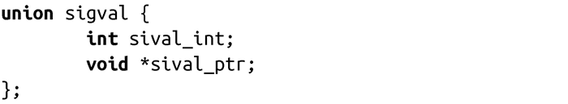

### 10.6.3　发送带附加信息（payload）的信号

正如我们前面所看到的，以SA_SIGINFO标志注册的信号处理程序传递了一个siginfo_t参数。该结构体包含了一个名为si_value的字段，该字段可以让信号产生者向信号接受者传递一些附加信息。

由POSIX定义的sigqueue()函数，允许进程发送带附加信息的信号：

sigqueue()的运行方式和kill()很类似。成功时，由signo表示的信号会被添加到由pid指定的进程或进程组的队列中，并返回0。信号的附加信息是由数值给定的，它是一个整数和void指针的联合：

失败时，该调用返回-1，并将errno设置为以下之一：

EAGAIN

调用的进程对入队的信号达到上限。

EINVAL

由signo指定的信号无效。

EPERM

调用进程缺乏足够的权限给任何指定的进程发送信号。发送信号的权限要求和kill()是一样的（见10.3节）。

ESRCH

由pid指定的进程或进程组不存在，或者进程是一个僵尸进程。

对于kill()调用，可以给signo传递空信号值（0），来测试权限。

