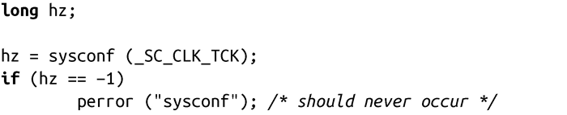

### 第11章　时间

在现代操作系统中，时间有很多不同的用途，很多程序都需要使用时间。内核通过三种方式来衡量时间：

墙钟时间<a class="my_markdown" href="['#anchor111']">[1]</a>（或真实时间，Wall Time）

这是真实世界中的物理时间和日期——也就是说，是墙壁上挂钟的时间。当和进程用户交互或对事件添加时间戳时，会使用墙钟时间。

进程时间（Process Time）

这是进程在处理器上消耗的时间。它既包括用户空间代码本身消耗的时间（用户时间），也包括该进程在内核上所消耗的时间（系统时间）。进程通常在对程序进行剖析、审计和统计时，需要使用进程时间，比如衡量某个算法消耗了多少处理器时间才完成。在这方面，墙钟时间可能会有误导作用，因为由于Linux本身的多任务特性，墙钟时间往往大于进程时间。相反，对于多个处理器和单线程的进程，对于某个操作，进程时间可能会超出墙钟时间。

单调时间

这种时间类型是严格线性递增的。大多数操作系统，包括Linux，使用系统的启动时间（从启动到现在的时间）。墙钟时间会发生变化——举个例子，可能用户进行了设置或因为系统连续调整时间来避免时钟倾斜——而且还可以引入其他引起时间不准确的因素，比如闰秒。相反，系统启动时间是对时间的精确和不变的表示方式。单调时间类型的重要性并不在于当前值，而是确保时间是严格线性递增，因此可以利用该特性来计算两次时间采样的差值。

以上三种时间衡量方式可以通过以下两种方式之一表示：

相对时间

它是相对于某些基准时间的值：举个例子，“5秒之后”或“10分钟前”。单调时间对于计算相对时间很有用。

绝对时间

它表示不含任何基准的时间，如“1968年3月25号正午”。墙钟时间是计算绝对时间的理想选择。

相对时间和绝对时间有不同的用途。一个进程可能需要取消500毫秒内的某个请求，每秒刷新屏幕60次，或者注意从操作开始到现在已经历时7秒了。所有这些都需要计算相对时间。相反，一个日历应用可能要保存用户的宴会日期是2月8日，当创建一个新的文件时，文件系统会给出当前完整的日期和时间（而不是“5秒前”这样的相对时间），用户的时钟显示的是公历时间，而不是从系统启动到现在的秒数。

UNIX系统把绝对时间表示成新纪元至今所经过的秒数，新纪元是定义成1970年1月1日早上00:00:00 UTC。UTC（协调世界时，Coordinated Universal Time）相当于GMT（格林威治标准时间）或Zulu时间。奇怪的是，这表示在UNIX系统中，即使是绝对时间，从底层来看，也是相对的。UNIX引入了一种特殊的数据类型来表示“从新纪元到现在的秒数”，我们将在下一节描述它。

操作系统通过“软件时钟（software clock）”获取时间的变化，软件时钟是软件内核所维护的时钟。内核启动一个周期性计时器，称为“系统计时器（system timer）”，以特定频率跳动。当计时器完成一个周期时，内核就把墙钟时间增加一个单位，称为“tick（刻度）”或“jiffy（瞬间）”。运行的tick计数称为“jiffies 计数器”。在Linux内核2.6以前，jiffies计数器的值是32位的，从内核2.6以后变成64位的计数器<a class="my_markdown" href="['#anchor112']">[2]</a>。

在Linux，系统计时器的频率称为Hz（赫兹），因为预处理器定义了一个完全相同的名字来表示这个概念。Hz的值是和体系结构相关的，并且不是 Linux ABI的一部分。因此，程序不能依赖于任何特定值，也不能期望它等于某个特定值。历史上，x86架构定义该值为100，表示系统计时器每秒钟运行100次（就是说系统计时器的频率是100Hz）。在这种情况下，jiffy的值就变为0.01秒。在Linux内核2.6中，内核编程人员把Hz的值一下子提升到1 000，使得每个jiffy的值变成0.001秒。但是，在Linux内核2.6.13以及之后的版本中，Hz的值是 250，每个jiffy为0.004秒<a class="my_markdown" href="['#anchor113']">[3]</a>。对于Hz值的选择，需要加以权衡：值越高，精度也越高，但计时器开销也越大。

虽然进程不应依赖于任何确定的Hz值，POSIX定义了一种机制，可以在运行时确定系统计时器频率：

当程序希望确定系统计时器频率时，该函数很有帮助，但是，没有必要通过它把系统时间转换成秒，因为大多数POSIX函数输出的时间测量结果已经被转换或者缩放成和Hz无关的确定值。和Hz不同的是，这个固定的频率是系统ABI的一部分，在x86上，其值是100。以系统时钟周期数作为返回值的POSIX函数，通过CLOCKS_PER_SEC来表示该固定的频率。

在某些情况下，一些突发事件会导致计算机意外关闭。有时，计算机甚至还会被断电。但是，当启动计算机时，时间还是正确无误。这是因为大多数计算机都有一个硬件时钟，由电池供电，在计算机关闭时保存时间和日期。当内核启动时，就从该硬件时钟来初始化当前时间。同样，当用户关闭计算机时，内核将时间写回到硬件时钟里。系统管理员可以通过hwclock命令将时钟更新为其他时间。

在UNIX系统上，对时间的管理涉及几个任务，其中只有一部分是所有进程都需要关心的，包括设定和取得当前墙钟时间，计算消耗时间，睡眠一段时间，执行精确的时间测量，并控制计时器。本章涵盖了时间相关的所有内容。我们将从Linux表示时间的数据结构开始看起。

