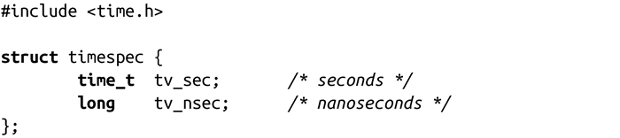

### 11.1.3　更精确的：纳秒级精度

由于毫秒级精度在某些场景下还是不够准确，timespec结构体将精度提高到了纳秒级。头文件<time.h>对其定义如下：

可以选择纳秒级精度后，很多接口更倾向使用纳秒级而非微秒级的精度。此外，timespec结构放弃使用suseconds_t，而是使用更简单的long类型。因此，引入timespec结构后，大多数时间相关的函数就采用了它，并得到更高的精度。但是，正如我们将看到的，还有个重要的函数仍然使用timeval结构体。

实际上，因为系统计时器没有提供纳秒级甚至微秒级的精度，这里所提到的结构体都无法提供其所声明的精度。不过，函数中尽量采用可用的高精度是较好的选择，因为这样就可以兼容系统所提供的各种精度。

