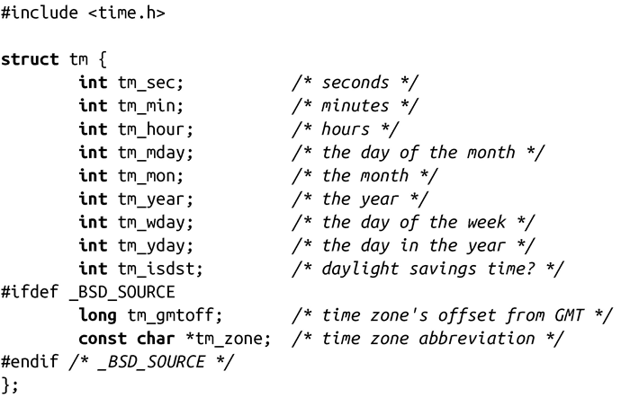

### 11.1.4　对时间进行分解

我们将要讨论的一些函数经常需要进行UNIX时间与字符串之间的转换，或者通过编程构建字符串来表示时间。为了简化这一过程，标准C提供了结构体tm，将UNIX时间拆分为人们更容易理解的格式。这个结构体也在<time.h>中定义：

tm结构体可以让我们更容易理解time_t的值代表什么，比如说，314159是周日还是周六（应该是前者）。从空间占用角度来看，通过这种方式来表示日期和时间显然是一个糟糕的选择，但是这种表示方式更易于和用户期望值之间互相转换。

tm结构体有如下这些字段：

tm_sec

在分钟后的秒数。这个值通常在0到59之间，但也可以达到61来表示最多2个闰秒。

tm_min

小时后的分钟数。这个值在0到59之间。

tm_hour

午夜后的小时数。这个值在0到23之间。

tm_mday

该月的日期。这个值在0到31之间。POSIX并没有指定0值，然而，Linux用它表示上个月的最后一天。

tm_mon

从一月以来的月数。这个值在0到11之间。

tm_year

从1900年以来的年数。

tm_wday

从周日以来的天数。这个值在0到6之间。

tm_yday

从1月1日以来的日期数。这个值在0到365之间。

tm_isdst

这个值用来表示夏令时（DST）在其他字段描述的时间是否有效。如果这个值为正，那么DST有效。如果是0，DST无效。如果是负数，DST的状态未知。

tm_gmtoff

以秒计的当前时区与格林威治时间的偏差值。这个字段仅仅在包含<time.h>之前定义了_BSD_SOURCE才会出现。

tm_zone

当前时区的缩写——例如EST。这个字段仅仅在包含<time.h>之前定义了_BSD_SOURCE才会出现。

