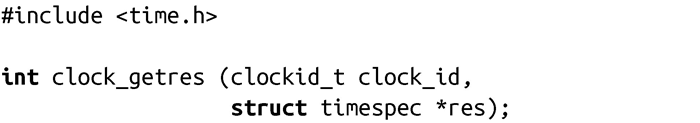
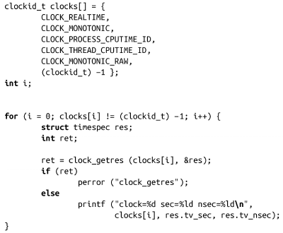
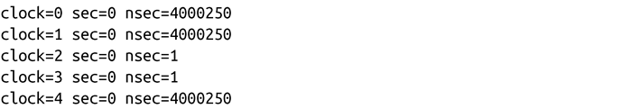

### 11.3　时间源精度

POSIX定义了clock_getres()函数，可以获取给定时间源的精度。

成功调用clock_getres()时，会将clock_id指定的时钟精度保存到res中。如果结果不是NULL，就返回0。失败时，函数返回-1，并设置errno为以下两个错误码之一：

EFAULT

res是一个非法的指针。

EINVAL

clock_id不是该系统上合法的时间源。

以下示例代码将输出先前讨论的五种时间源精度：

在现代x86系统上，输出大致类似于下面这样：

注意，4 000 250纳秒是4毫秒，也就是0.004秒。反过来，0.004秒也是给定Hz值为250的x86系统时钟的精度（这正是我们在本章第一节所讨论的）。这样，我们看到CLOCK_REALTIME和CLOCK_MONOTONIC二者都和jiffy数以及系统计时器所提供的精度有关。相反，CLOCK_PROCESS_CPUTIME_ID和CLOCK_ THREAD_CPUTIME_ID则使用了一种更高精度的时间源——在同一台x86机器上，即TSC，提供了纳秒级精度。

在Linux上（还有大多数其他UNIX系统），所有使用POSIX时钟的函数都需要将目标文件与librt链接。举个例子，如果把刚才的代码片断编译成完全可执行程序，可能会用到以下命令：

