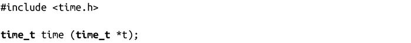
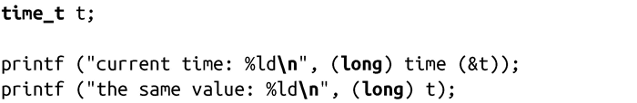

### 11.4　取得当前时间

应用程序出于以下几个目的，需要获取当前日期和时间：显示给用户、计算相对时间或者流逝的时间、给事件标记时间戳等。最简单也是最常用的获取当前时间的方法是通过time()函数：

time()调用会返回当前时间，以自从新纪元以来用秒计的流逝的秒数来表示。如果参数t非NULL，该函数也将当前时间写入到提供的指针t中。

出错时，函数会返回-1（强制类型转换成time_t），并相应设置errno的值。errno值只能是EFAULT，表示t是个非法的指针。

举个例子：

>  **表示一致但不准确的计时方法**
> time_t表示的“自从新纪元以来流逝的秒数”并不是真正从那刻起经过的秒数。UNIX的计算方法假定所有能被四整除的年份都是闰年，并且忽略了所有的闰秒。time_t表示法的要点不在于精确，而在于一致。

