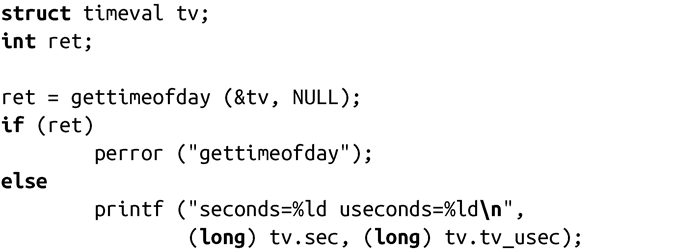

### 11.4.1　更好的接口

gettimeofday()函数扩展了time()函数，在其基础上提供了微秒级精度支持：

成功调用gettimeofday()时，会将当前时间放到由tv指向的timeval结构体中，并返回0。结构体timezone和参数tz已经废弃了，都不应该在Linux中使用。调用时，参数tz总是传递NULL。

失败时，调用返回-1，并把errno值设置为EFAULT。这是唯一可能的错误值，表示tv或tz是个非法指针。

举个例子：

timezone结构已经废弃了，因为内核不再管理时区，而且glibc不能使用timezone结构的tz_dstime字段。我们将在下一节研究如何操作时区。

