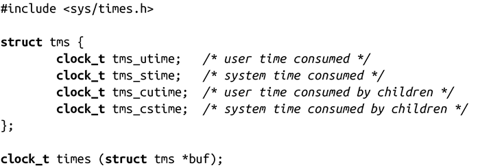

### 11.4.3　获取进程时间

times()系统调用取得正在运行的当前进程及其子进程的进程时间，进程时间以时钟报时信号表示。

成功时，调用会将发起进程及其子进程消耗的进程时间写入到buf所指向的tms结构体中。时间统计分成用户时间和系统时间。用户时间是在用户空间执行代码所用的时间。系统时间是在内核空间执行所用的时间——例如进行系统调用或者发生页错误所消耗的时间。每个子进程的耗时统计是在该子进程已经结束，且父进程对其调用了waitpid()（或者相关函数）之后才执行。调用返回时钟报时信号数，并从过去的某个参考点单调递增。过去曾以系统启动时间作为参考点——因此，times()函数返回系统启动以来的滴答数，而目前的参考点则是以系统启动前大约429 000 000秒开始计算。内核编程人员之所以这样做是为了捕获那些无法处理系统启动瞬间发生问题的内核代码。因此，该函数返回的绝对值是没什么用的，而两次调用的相对时间还是有意义的。

失败时，调用会返回-1，并相应设置errno值。在Linux上，唯一可能的错误码是EFAULT，表示buf是非法指针。

