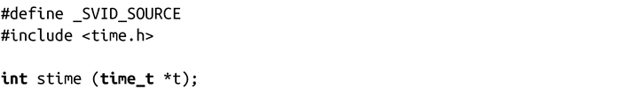
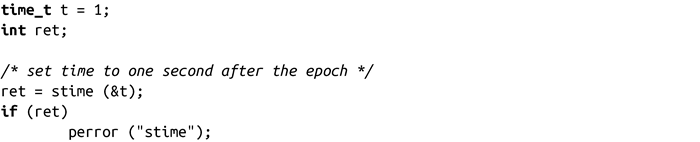

### 11.5　设置当前时间

前面的章节讨论了如何获取时间，应用程序有时也会需要将当前时间日期设置为一个给定值。大多数系统都会提供一个独立的工具（例如date命令）来解决这个问题。

在时间设置中，与time()函数相对应的是stime()函数：

成功调用stime()函数时，会设置系统时间为t所指向的值并返回0。调用需要发起者拥有CAP_SYS_TIME权限。一般情况下，只有root用户才有该权限。

失败时，调用会返回-1，并设置errno值为EFAULT，表示t是非法指针，或者EPERM，表示发起者没有CAP_SYS_TIME权限。

其用法相当简单：

我们将在接下来一节看看将我们所习惯的时间格式方便地转换成time_t类型。

