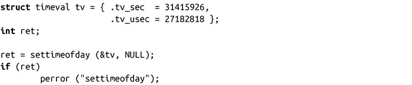

### 11.5.1　设置支持高精度的时间

和gettimeofday()函数相对应的是settimeofday()函数：

成功调用settimeofday()函数时，会将系统时间设定为tv提供的值，并返回0。和gettimeofday()一样，最好给参数tz传递NULL。失败时，调用返回-1，并将errno设置为下列值之一：

EFAULT

tv或者tz指向非法内存。

EINVAL

提供的结构体中某个字段为无效值。

EPERM

调用进程没有CAP_SYS_TIME权限。

下面的例子将当前时间设置为1979年12月中旬的周六：

