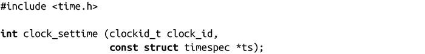

### 11.5.2　设置时间的高级接口

就像clock_gettime()改进了gettimeofday()一样，有了clock_settime()函数，settimeofday()就被废弃了：

成功时，调用返回0，而clock_id指定的时间源被设置为ts指定的时间。失败时，调用返回-1，并设置errno为下列值之一：

EFAULT

ts不是一个合法指针。

EINVAL

clock_id不是该系统上的合法时间源。

EPERM

进程没有设定该时间源的相关权限，或者该时间源不能被设置。

在大多数系统上，唯一可以设置的时间源是CLOCK_REALTIME。因此，这个函数比settimeofday()函数的唯一优越之处在于提供了纳秒级精度（还有不用处理无聊的timezone结构体）。

