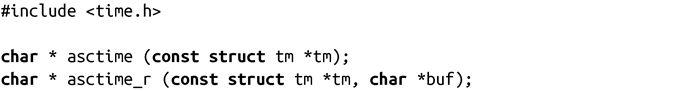
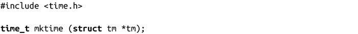
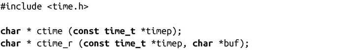
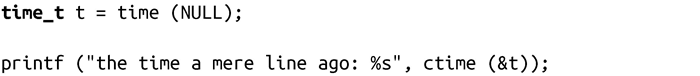
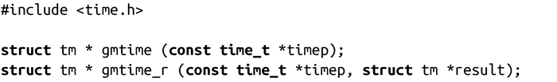
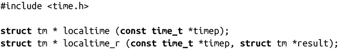
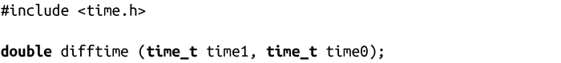

### 11.6　玩转时间

UNIX系统和C语言提供了一系列函数来对时间进行“分解”（ASCII字符串表示的时间），提供了time_t.asctime()，可以转换成tm结构体——把时间“分解”转换成ASCII字符串：

它返回一个指向静态分配的字符串的指针。之后对任何时间函数的调用都可能覆盖该字符串，asctime()不是线程安全的。

因此，多线程程序（以及讨厌这种糟糕设计的编程人员）应该使用asctime_r()函数，不要用asctime()函数。asctime_r()函数不使用静态分配字符串的指针，而是通过buf提供，buf的长度至少为26个字符长度。

这两个函数在出错时都返回NULL。

mktime()函数也可以转换成tm结构体，但是它转换成time_t类型。

mktime()还通过tzset()函数，将时区设置为tm指定的值。出错时，返回-1（强制类型转换成time_t）。

ctime()函数将time_t转换成ASCII表示方式：

失败时，ctime()函数会返回NULL。举个例子：

需要注意的是，在printf中没有输出换行符，但是ctime()函数会在其返回字符串后追加了一个空行，这可能会有些不方便。

类似于asctime()函数，ctime()函数会返回一个静态字符串指针。由于这样不是线程安全的，基于线程的多线程程序应该用ctime_r()来替代它，ctime_r()函数在buf所指向的缓冲区上工作，缓冲区长度最少为26个字符。

gmtime()函数会将给出的time_t转换为tm结构体，通过UTC时区格式表示：

失败时，返回NULL。

gmtime()函数返回静态分配的结构体指针，因此也不是线程安全的。基于线程的多线程程序应使用gmtime_r()，该函数在result指向的结构体上完成操作。

localtime()和localtime_r()函数则分别类似于gmtime()和gmtime_r()，但它们会把time_t表示为用户时区：

类似mktime()，调用localtime()也会调用tzset()函数，并初始化时区。localtime_r()函数是否也执行这个步骤，标准中没有指明，因此是不确定的。

difftime()返回两个time_t值的秒数差值，并强制类型转换成double：

在所有POSIX系统上，time_t都是算术类型，而difftime()相当于执行以下表达式的返回值，但它对减法溢出进行了检测：

在Linux上，由于time_t是个整型，因而没有必要将其转换成double类型。但是，为了保持可移植性，最好使用difftime()函数。

