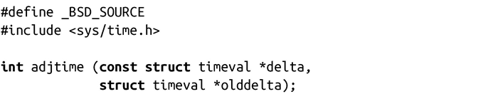
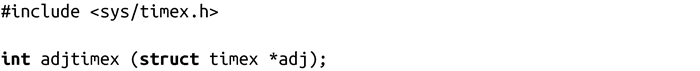
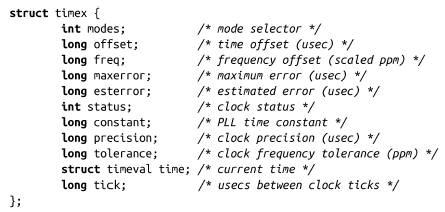

### 调校系统时钟

墙钟时间的突然变化会对那些操作依赖于绝对时间的应用造成严重破坏。假设有这样一个make示例（make是根据Makefile的内容来构建软件项目的程序）。每次执行该程序并不会重新构建整个源代码树，否则，对于大型软件项目，一个文件的小改动可能会花费数个小时进行重新编译。make一般是比对源文件（比如，wolf.c）和目标文件（wolf.o）的时间戳。如果源文件——或者其依赖文件，如wolf.h——比目标文件新，make会重新编译源文件，生成一个更新的目标文件。但是，如果源文件的修改时间不比目标文件新，则不做处理。

了解了这些基本知识后，当用户发现他的时钟比正确时间晚了几个小时，并运行date来更新系统时间，考虑一下会发生什么事情。如果用户更新并重新保存了wolf.c，可能就会有麻烦了。如果用户把当前时间向前调整，wolf.c的修改时间可能会比wolf.o要旧（虽然实际上不是这样！），就不会重新编译wolf.c。

为了防止这样的问题发生，UNIX提供了adjtime()函数，用户可以以指定的增量逐渐地调整时间。这样做是为了让后台程序，如网络时间协议守护进程（NTP），可以逐渐调整时间误差的差值，通过adjtime()减少对系统的影响。周期性对时钟误差执行的调整称为“slewing（回旋）”：

adjtime()调用成功时，内核会使用增量delta来逐渐调整时间，然后返回0。如果delta指定的时间是正值，内核将加速系统时钟直到修正彻底完成。如果delta指定的时间是负值，内核将减缓系统时钟直到修正完成。内核进行的所有改动都保证时钟单调递增并且不会有突然的跳变。即使是 delta为负值，调整仍然不会回拨时钟，而是调慢时钟直到系统时间达到正确的时间。

如果delta不是NULL，内核停止处理所有之前注册的改动。对于已经完成的改动，内核将继续保留。如果olddelta不是 NULL，所有先前注册但未完成的改动将写入timeval结构体。delta设置为NULL，并将olddelta设置为一个合法值，将可以获得所有正在进行的改动。

adjtime()所进行的改动应该不大——理想的例子是之前提到的NTP，每次只改动几秒。Linux可以做的最小修改和最大修改阈值均有几千秒。

出错时，adjtime()返回-1，并设置errno为下列值之一：

EFAULT

delta或olddelta不是合法指针。

EINVAL

delta指定的调整过大或者过小。

EPERM

发起调用的用户没有CAP_SYS_TIME权限。

RFC 1305定义了一个比adjtime()采用的渐进调整方法更加强大和更加复杂的时钟调整算法。Linux用adjtimex()系统调用实现了该算法。

调用adjtimex()可以将内核中与时间相关的参数读取到adj指向的timex结构体中。此外，系统调用会根据该结构体的modes字段来额外设置某些参数。

timex结构体在头文件<sys/time.h>中定义如下：

modes字段是由零个或多个以下标志位按位或的结果：

ADJ_OFFSET

通过offset设置时间偏移量。

ADJ_FREQUENCY

通过freq设置频率偏移量。

ADJ_MAXERROR

通过maxerror设置最大错误值。

ADJ_ESTERROR

通过esterror设置估计错误值。

ADJ_STATUS

通过status设置时钟状态。

ADJ_TIMECONST

通过constant设置锁相环（PLL）时间常量。

ADJ_TICK

通过tick设置时钟计时信号值。

ADJ_OFFSET_SINGLESHOT

使用简单算法，如adjtime，直接通过offset设置时间偏移量。

如果modes是0，就不会设置任何值。只有拥有CAP_SYS_TIME权限的用户才能给modes赋非零值；任何用户都可以将设置mode为0，从而获取所有参数，但不能设置任何值。

成功时，adjtimex()会返回当前时钟状态，其值如下：

TIME_OK

时钟被同步。

TIME_INS

将增加1闰秒。

TIME_DEL

将减少1闰秒。

TIME_OOP

恰好在1闰秒中 。

TIME_OOP

刚刚出现1闰秒。

TIME_BAD

时钟未同步。

失败时，adjtimex()会返回-1，并设置errno值为下列错误码之一：

EFAULT

adj不是一个合法指针。

EINVAL

一个或更多的modes、offset或者tick非法。

EPERM

modes是非零值，但调用者没有CAP_SYS_TIME权限。

adjtimex()系统调用是Linux特有的。关心可移植性的应用应该倾向于使用adjtime()。

RFC 1305定义了一个复杂的算法，对adjtimex()的全面讨论超出了本书的范围。如果想了解更多信息，请参阅RFC。

