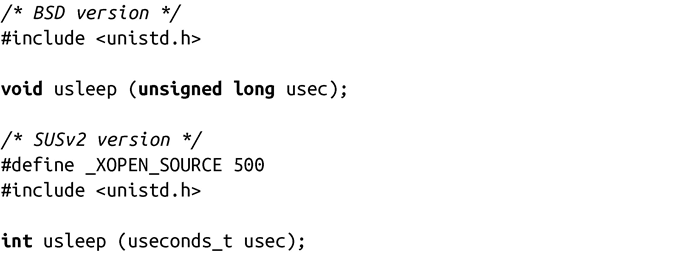
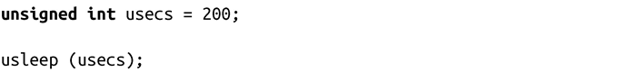
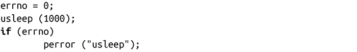

### 11.7.1　以微秒级精度睡眠

以整秒的粒度进行睡眠实在是太死板了。在现代操作系统上，1秒钟实在太久了，所以程序经常需要在低于秒级别的精度下睡眠。看一下 usleep()：

成功调用usleep()会使发起进程睡眠usec微秒。不幸的是，BSD和单一UNIX规范（Single UNIX Specification，SUS）在该函数原型定义上持不同意见。BSD版本接收unsigned long类型的参数，并且没有返回值。但是，SUS版本定义 usleep()接受一个useconds_t类型，并返回一个整型。如果XOPEN_SOURCE定义为500或者更大的值，Linux就和SUS一样。如果XOPEN_SOURCE未定义，或者设定值小于500，Linux就和BSD一样。

SUS版本在成功时返回0，出错时返回-1。合法的errno值包括：EINTR表示睡眠被信号打断，EINVAL表示由于usecs太大而导致的错误（在Linux上，该类型的整个范围都是合法的，因此该错误不会出现）。

根据SUS规范，useconds_t类型是个最大值为1 000 000的无符号整型。

由于不同原型之间的冲突，以及部分UNIX系统可能只支持一种，在你的代码中不要包括useconds_t类型是明智的做法。为了尽可能满足可移植性，最好假设参数是无符号整型，并且不要依赖于usleep()的返回值：

用法如下：

这样就可以满足该函数的不同形式，并且可以检测错误：

但是对大多数程序而言，它们并不检查也不关心usleep()的错误。

