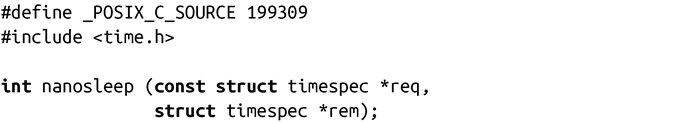
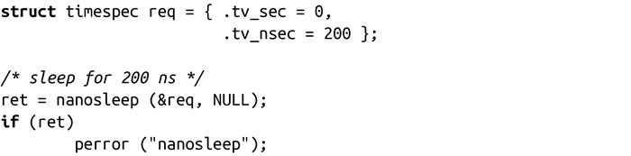
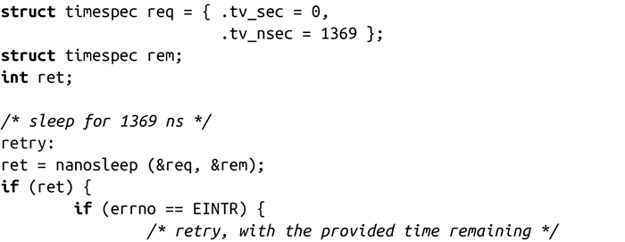
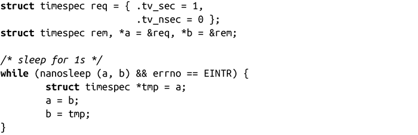

### 11.7.2　以纳秒级精度睡眠

Linux不赞成使用usleep()函数，而是建议使用nanosleep()函数，它是一个更加智能且可以提供纳秒级精度的函数：

成功调用nanosleep()时，使进程睡眠req所指定的时间，并返回0。出错时，调用返回-1，并设置errno为相应值。如果信号打断睡眠，调用可在指定时间消耗完之前返回。在这种情况下，nanosleep()返回-1，并设置errno值为EINTR。如果rem不是NULL，函数把剩余睡眠时间（req中没有睡眠的值）放到rem中。然后，会重新调用程序，将rem作为参数传递给req（像本节之后所示）。

下面是其他可能的errno值：

EFAULT

req或者rem不是合法指针。

EINVAL

req中有个字段非法。

在一般情况下，用法很简单：

下面是当睡眠被打断时使用第二个参数来继续的例子：

最后，下面是另外一种方法（可能更加有效，但可读性较差），可以达到同样效果：

和sleep()、usleep()相比，nanosleep()有以下几个优点：

+ 提供纳秒级精度，其他两者只能提供秒或者微秒精度。
+ POSIX.1b标准。
+ 不是用信号来实现（该方法的缺陷将在之后讨论） 。

尽管Linux不赞成使用usleep()，很多程序还是倾向于使用usleep()而不是nanosleep()。因为 +nanosleep()是POSIX标准，并且不使用信号，新程序最好使用它（或者将在下一节讨论的接口），而不要用sleep()或者usleep()。

