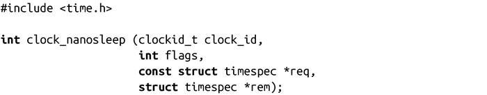
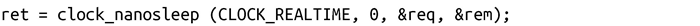
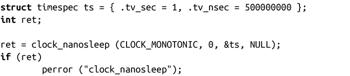
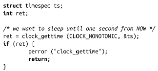
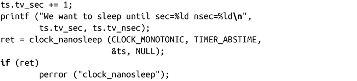

### 11.7.3　实现睡眠的高级方法

我们已经探讨了各种类型的时间函数。此外，POSIX时钟函数中还提供了一个最高级的睡眠函数：

clock_nanosleep()的行为类似于nanosleep()。实际上，这个调用：

等价于这个调用：

两者的差别在于clock_id和flags参数。前者指定了用来衡量的时间源。大部分时间源都是合法的，虽然你不能指定调用进程的CPU时钟（例如 CLOCK_PROCESS_CPUTIME_ID），这样做没有任何意义，因为调用将使进程挂起，这样进程时间将停止增长。

时间源的选择取决于你让程序进入睡眠的目的。如果你想要睡眠到某个绝对时间值，CLOCK_REALTIME大概是最好的选择。如果你准备睡眠某个相对值的时间，CLOCK_MONITONIC绝对是理想的时间源。

flags参数是TIMER_ABSTIME或者0。如果是TIMER_ABSTIME，req指定的是一个绝对的时间值。这样处理解决了一个潜在的竞争条件。为了解释该参数的值，可以假设一个进程处于时间T+0，想要睡眠到时间T+1。在T+0时，进程调用了clock_gettime()来取得当前时间（T+0）。然后从T+1中减去T+0，得到Y，传递给clock_nanosleep()。在获取时间和进程进入睡眠之间，总是需要一些时间的。然而糟糕的是，如果在这期间进程被调度失去处理器控制权或者发生一个页错误，对于此类情况，我们该如何处理？在取得当前时间，计算时间差，以及实际睡眠之间总是存在竞争条件。

TIMER_ABSTIME标志允许进程直接指定T+1，这样就可以避免竞争。在指定时间源到达T+1前，内核会一直挂起该进程。如果指定时间源的当前时间已经超过T+1，调用会立即返回。

我们一起来看一下相对睡眠和绝对睡眠。下面的例子中，进程睡眠1.5秒钟：

相反，下面这个例子会一直sleep到某个绝对时间，在本例中是clock_gettime()调用返回CLOCK_MONOTONIC时间源之后精确的一秒钟：

大多数程序只需要执行相对睡眠，因为它们的睡眠并不十分严格。然而某些实时进程，对时间要求相当严格，需要绝对睡眠来避免产生潜在的具有破坏性的竞争条件。

