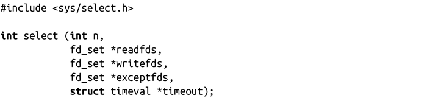
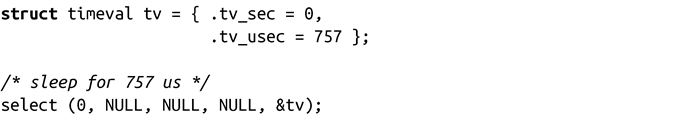

### 11.7.4　sleep的可移植实现

回顾一下我们在第2章中提到的select()：

正如当时所提到的那样，select()提供了一种实现比秒级精度更高的sleep方法，而且该方法是可移植的。在很长一段时间内，可移植的UNIX程序由于sleep()无法满足短暂的睡眠需求而表现得很糟糕：usleep()并不是在各个系统上都实现的，而nanosleep()还没有实现。编程人员发现给select()的n传递0，并给所有三个fd_set指针传递NULL，以及把需要睡眠的时间传给timeout，就产生了一种可移植且有效的方法让进程睡眠：

如果需要考虑对于较早的UNIX系统的可移植性，使用select()可能是最好的办法。

