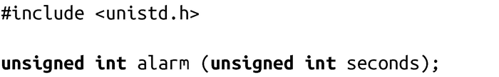
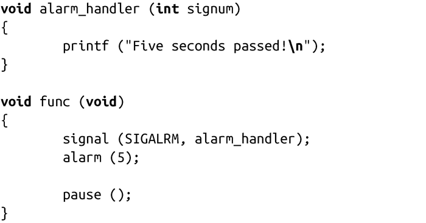

### 11.8.1　简单的闹钟

alarm()是最简单的定时器接口：

对该函数的调用会在真实时间（real time）seconds秒之后将SIGALRM信号发给调用进程。如果先前的信号尚未处理，调用就取消该信号，并用新的来代替它，并返回先前的剩余秒数。如果seconds是0，就取消掉之前的信号，但不设置新的闹钟。

想要成功调用该函数，需要为SIGALRM信号注册一个信号处理程序。（信号和信号处理程序的内容在前一章已经讨论过。）下面的代码段注册了一个SIGALRM处理程序，alarm_handler()，并设置了一个5秒钟的闹钟：

