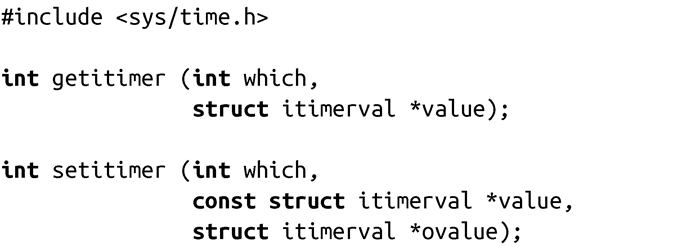
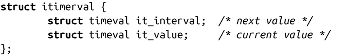
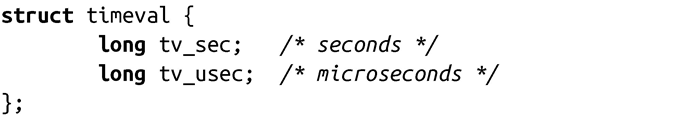
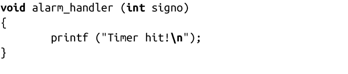
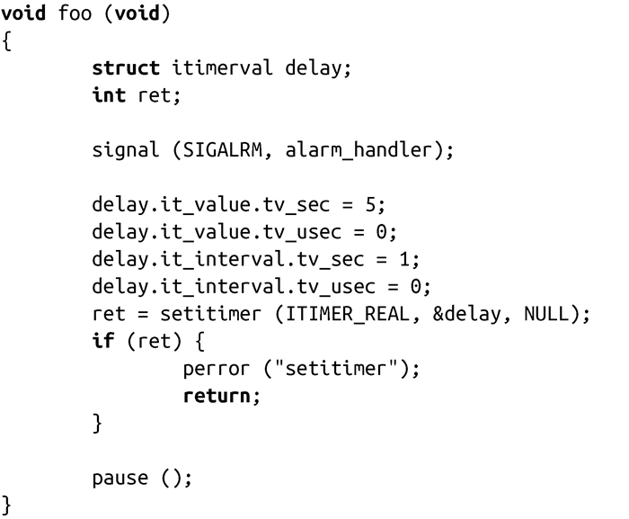

### 11.8.2　计时器（interval timer）

计时器系统调用，最早出现在4.2BSD中，目前已经是POSIX标准，它可以提供比alarm()更多的控制：

计时器和alarm()的操作方式相似，但它能够自己自动重启，并在以下三个独有的模式之一下工作：

ITIMER_REAL

测量真实时间。当指定的真实时间过去后，内核将SIGALRM信号发给进程。

ITIMER_VIRTUAL

只在进程用户空间的代码执行时减少。当指定的进程时间过去后，内核将SIGVTALRM发给进程。

ITIMER_PROF

在进程执行以及内核为进程服务时（例如完成一个系统调用）都会减少。当指定的时间过去后，内核将SIGPROF信号发给进程。这个模式一般和ITIMER_VIRTUAL共用，这样程序就能衡量进程消耗的用户时间和内核时间。

ITIMER_REAL衡量的时间和alarm()相同，另外两个模式对于剖析程序也很有帮助。

itimeval结构体允许用户设置定时器过期或终止的时限，如果设定了值，则在过期后重启定时器：

回顾一下先前可以提供微秒级精度的timeval结构体：

settimer()设置一个过期时间为it_value的定时器。一旦时长超过it_value，内核使用it_interval所指定的时长重启定时器。当it_value达到0时，时间间隔则被设置为it_interval。如果定时器失效且it_interval为0 ，则不会重启定时器。类似地，如果一个活动定时器的it_value被设置为0，则定时器停止，并且不会重启。

如果ovalue不是NULL，则会返回which类型的计时器的前一个值。

getitimer()返回which类型的计时器的当前值。

两个函数在成功时都返回0，并在出错时返回-1，设置errno为下列值之一：

EFAULT

value或者ovalue不是合法指针。

EINVAL

which不是合法的计时器类型。

下面的代码段创建了一个SIGALRM信号处理程序（参见第10章），并将计时器的过期时间设置为5秒，后续的过期时间为1秒。

一些UNIX系统通过SIGALRM实现了sleep()和usleep()。很显然，alarm()和setitimer()也使用了SIGALRM。因而，程序员必须十分小心，不要重复调用这些函数。重复调用的结果是未定义的。如果只是需要短暂的等待，程序员应该使用nanosleep()，因为 POSIX标准中规定nanosleep()不能使用信号。如果需要定时器，程序员应该使用setitimer()或者alarm()。

